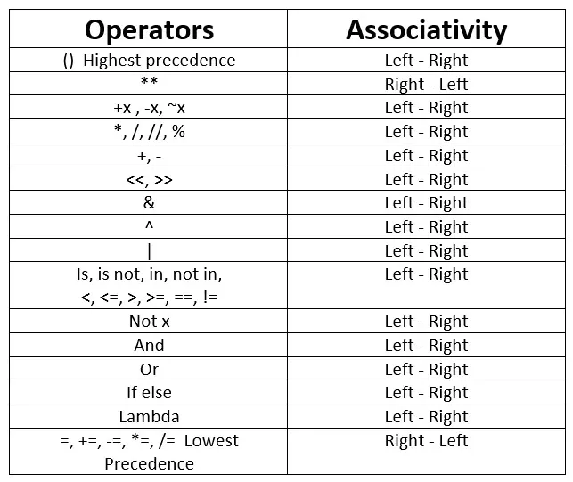

# Tecnicatura Superior en Desarrollo d SOftware
[Plan de estudios](https://docs.google.com/document/d/1TvsNM_z6B2KHBOyKITbnY7X0KlU6BsNd/edit?tab=t.0#heading=h.h44t47frzt2n)

```bash
git clone https://github.com/VictoriaIleanaRodriguezMora/ifts.git
cd ifts/121_programacion_orientada_a_objetos/materia.md
```

Intérprete vs Entorno de ejecución
https://www.ionos.com/es-us/digitalguide/paginas-web/desarrollo-web/compilador-e-interprete/
https://www.reddit.com/r/pycharm/comments/t5qw9q/what_is_the_difference_between_using_environment/?tl=es-es
https://stackoverflow.com/questions/3265357/compiled-vs-interpreted-languages
https://builtin.com/software-engineering-perspectives/compiler-vs-interpreter
> Compilador: Un compilador traduce el código de un lenguaje de programación de alto nivel a código de máquina antes de que se ejecute el programa.

> Intérprete: Un intérprete traduce el código escrito en un lenguaje de programación de alto nivel en código de máquina línea por línea a medida que se ejecuta el código. 

> El intérprete es parte del entorno. El intérprete es el tiempo de ejecución real de Python, lo que lee tu código. El entorno incluye tu intérprete, más todos los módulos que has instalado para tu intérprete.


precedencia en python
https://oregoom.com/python/precedencia-de-operadores/
Exponentes (**)
Operadores unarios (+, -, ~)
Multiplicación, División, Módulo, y División Entera (*, /, //, %)
Suma y Resta (+, -)
Operadores de Desplazamiento a la Izquierda y Derecha (<<, >>)
Operadores de Bit a Bit (&, ^, |)
Operadores de Comparación (<, <=, >, >=, ==, !=)
Operadores de Pertenencia (in, not in), Operadores de Identidad (is, is not)
Operadores Lógicos (not, and, or)

https://www.freecodecamp.org/espanol/news/operadores-basicos-en-python-con-ejemplos/
