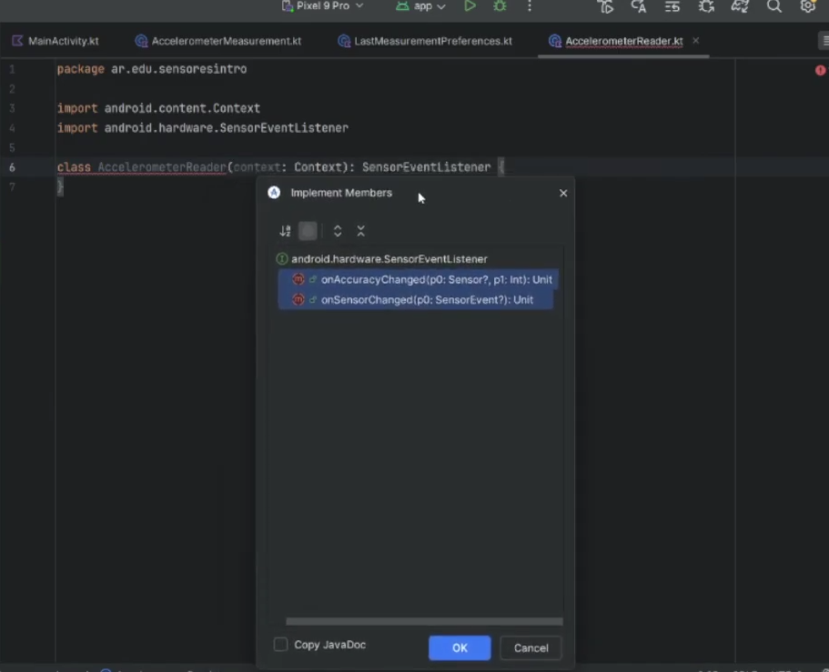

Long - Utilizar Long para números enteros fuera del rango Int .

Los tipos enteros almacenan números enteros, positivos o negativos (como 123 o -456), sin decimales. Los tipos válidos son Byte, Short, Int y `Long`.

Los tipos de punto flotante representan números con una parte fraccionaria, que contienen uno o más decimales. Hay dos tipos: Floaty Double.

El Long tipo de datos puede almacenar números enteros desde -9223372036854775808 hasta 9223372036854775807. Esto se utiliza cuando Intno es lo suficientemente grande como para almacenar el valor. Opcionalmente, puede terminar el valor con una "L":

Clase padre SensorEventListener me obliga a implementar onAccuracyChanged y onSensorChanged

getSystemService() devuelve un tipo muy genérico: Any? (o Object en Java).
Kotlin no sabe automáticamente que el servicio que estoy pidiendo es específicamente un SensorManager.

getSystemService() - devuelve Any?
as SensorManager - convierte ese Any? en un SensorManager

sino, sensorManager es un objeto comun, que no tiene métodos como getDefaultSensor

-----------------------------------
Android crea un archivo interno tipo:

sensor_prefs.xml

y guarda pares clave/valor:

last_x -> 2.4
last_y -> 8.9
last_z -> 0.3
last_timestamp -> 174845000

¿Qué es getSystemService()?
Android tiene servicios internos:
- ubicación
- wifi
- bluetooth
- sensores
- cámara
- etc
Con: context.getSystemService(...) le pido uno al sistema operativo.

devuelve Any? Porque el método sirve para MUCHOS servicios distintos. Entonces Android no sabe cuál quiero. `as SensorManager` 'este Any en realidad es un SensorManager'. Es un CAST Any --> SensorManager.

A partir de ahí estan disponibles métodos cómo:  `registerListener(), getDefaultSensor()`

`SensorManager` 
Es el objeto que:
- conoce los sensores
- te deja acceder a ellos
- te deja suscribirte
- te envía eventos

`(ObjetoAccelerometerMeasurement) -> Unit`
una función que:
- recibe una medición
- no devuelve nada

CELULAR SE MUEVE
       ⬇
Android detecta cambio del sensor
       ⬇
onSensorChanged() se ejecuta
       ⬇
creás ObjetoAccelerometerMeasurement
       ⬇
onMedicionChanged?.invoke(ObjetoMedidas)
       ⬇
se ejecuta:
currentMeasurement = measurement
       ⬇
Compose detecta cambio de estado
       ⬇
la UI se redibuja
       ⬇
MeasurementCard muestra nuevos valores

------------------------------------------------------------

SENSOR FÍSICO
   ⬇
AccelerometerReader
   ⬇
MainActivity (estado)
   ⬇
Compose UI
   ⬇
Pantalla

------------------------------------------------------------

Botón guardar
   ⬇
SharedPreferences
   ⬇
Persistencia

### El problema que resuelve DisposableEffect

Compose puede:

crear UI
destruir UI
recrearla
recomponerla

MUCHAS veces

Entonces:
“¿cuándo empiezo a escuchar el sensor?”
“¿cuándo dejo de escuchar?”

Necesito enganchar en el ciclo de vida del composable.

## DisposableEffect está pensado para:
“abrir algo y luego cerrarlo”

Ejemplos:

escuchar sensores
escuchar GPS
escuchar cámara
broadcast receivers
observers
listeners

- https://kotlinlang.org/docs/numbers.html 
- https://www.w3schools.com/kotlin/kotlin_data_types.php
- https://medium.com/@helmersebastian/clean-sharedpreferences-in-android-using-kotlin-delegation-ffabffd26990
- https://developer.android.com/training/data-storage/shared-preferences?hl=es-419
- 

