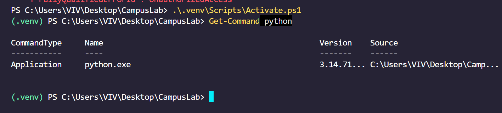

# Notas clase 06
# Proyecto - 2

Un entorno virtual es una copia liviana del intérprete de Python con su propia carpeta de paquetes. 

Sin entorno virtual, todo lo que instales queda en el Python del sistema y compartido con cualquier otro proyecto: dos trabajos que necesiten versiones distintas de Django se pisan, y arreglar uno rompe el otro. 

El módulo venv viene incluido en Python, no hay que instalarlo.

> Crear el entorno no es usarlo. Son dos pasos distintos. Crear y activar

Activarlo es lo que hace que python y pip apunten a ese entorno y no al del sistema.

La activación pone la carpeta del entorno adelante de todo en el PATH, que es la lista de lugares donde la terminal busca los programas que le pedís. Por eso a partir de ahí python encuentra primero el del entorno.

La señal de que está activo es que el prompt de la terminal pasa a mostrar (.venv) adelante.

- La activación vale para esa terminal y nada más.
- La carpeta .venv no se sube al repositorio
- Lo que se versiona es la receta

> [!NOTE]
> Con `Get-ChildItem -Force` (powershell) se ve la carpeta .git

```cmd
py install 3.14

# Crear
py -3.14 -m venv .venv
# Activar
.\.venv\Scripts\Activate.ps1
# Comprobar
Get-Command python
```

> [!IMPORTANT]
> Obtuve este error y lo solucioné con este enlace:
> - https://es.stackoverflow.com/questions/321611/problema-con-scripts-en-visual-studio-code
>
> 
> 

Luego de tirar ese comando, la consola salió bien, el paso de Activar y Comprobar



Con esto tambien se solucionaba
```cmd
Set-ExecutionPolicy -Scope Process Bypass
```

### Qué python se usa.

> [!IMPORTANT]
> Django 6 exige Python 3.12 o superior

```cmd
python --version
```

# Proyecto - 3 (incompleto)

pip es el instalador de paquetes de Python: recibe un nombre, lo busca en `PyPI (Python Package Index, el repositorio público donde la comunidad publica sus paquetes)`, lo descarga junto con las dependencias que ese paquete necesite y lo deja dentro del entorno activo.

> [!WARNING]
> Lo invocamos como `python -m pip` y **no** como `pip` a secas por una razón concreta: 
> 
> `python -m pip` usa el pip del python que está activo, mientras que pip suelto puede ser cualquier otro que ande dando vueltas en el sistema.
> 
>  Es la diferencia entre instalar en el entorno y creer que instalaste en el entorno.


- `Django` (el framework)
- `django-ninja` (la capa de API, con validación y documentación automática)
- `PyJWT` (firma y verificación de los tokens), python-dotenv (el que lee el archivo .env con la configuración propia de cada máquina)
- `Pillow` (la biblioteca de imágenes de Python, que Django exige para usar un ImageField).


Instalar no alcanza: lo que instalaste vive adentro de .venv, que no se sube al repositorio. Si tu compañero clona el proyecto, se encuentra con el código y sin una sola dependencia. 

Lo que `se versiona` es `la lista`, y esa lista es `requirements.txt`: un `archivo de texto con un paquete por renglón` y su `versión exacta`, en el formato que entiende `pip install -r`
```cmd
pip install -r

pip freeze # mira el entorno activo y escribe todo lo que hay instalado con la versión exacta de cada cosa
```

El archivo se genera con
```cmd
python -m pip freeze > requirements.txt
```


> [!NOTE]
> el > es el operador de la terminal que redirige esa salida a un archivo en vez de mostrarla en pantalla
