# Notas clase 06


```cmd
ls
```


> [!NOTE] Son iguales, para la creación del proyecto.
```cmd
python3 manage.py startproject

django-admin startproject
```

> [!NOTE] Para levantar el proyecto
Este comando lo corre desde la ruta principal, la raiz del proyecto
```cmd
python3 manage.py run server 0.0.0.0.1233
```

Este comando lo corre desde la ruta principal, la raiz del proyecto
```cmd
django-admin run server 0.0.0.0.1233
```
django-admin --> creación inicial del proyecto, crear carpetas archivos, etc


> [!NOTE] DJANGO ADMIN
> django-admin funciona para la creacion inicial del proyecto

django-admin es un patrón de diseño de  arquitectura, que se llama MVP, calco de MVC. Modelo Vista Controlador. 

> [!CAUTION] DUDA
> para cuando python3 manager y para cuando django admin


> [!NOTE] Note | MVC, MVT 

- MVC --> Model View Controller
- MVT --> Model View Template
24.00
- Modelo: Se almacena lógica a la creacion de tablas, columnas, etc
- Vista: Logica de  mostrar o generar el html
- Controlador: Lógica de negocio (relacionado a la lógica de la empresa, cómo se hacen las cosas. es mas decicsion, más humano)

Si crece mucho, se puede sacar aparte en `logic.py` dentro del módulo.
Lo ORQUESTA la view. Cuando queremos buscar lógica, se va a la view. 

> [!WARNING] Warning | IMPORTANTISIMO Flujo de DJANGO
> Todo en django arranca en .env > lib > django > 
> Django lo que hace es agarra su proyecto y arriba de estas funcionalidades le aplica lo que nosotros escribimos. Es cómo un callback 

Lo primero que hace una persona es ingresar a nuestra vista, django funciona como un orquestador, django está escuchando. 
> [!NOTE] Note | ¿Quién está escuchando?
> `asgi.py` ASINCRONICO o `wsgi.py` SINCRONICO, dependiendo del servidor interno que estemos hablando

Nosotros no lo usamos, lo usa django. Lo disponibilizan afuera en estos archivos, por si queremos hacer algo afuera, a nivel de lo primero que entra en django, va a pasar por ahi, por esos archivos. ahi levanta la app. Y esto va a correr, cuando le decimos al servidor, quedate escuchando y levantame el servidor, el run server, entra por ahí. 

Una vez que se queda escuchando, empieza a redirigir desde `urls.py` a las urls que tengamos configuradas. En `urlpatterns`, cuando quiera buscar la url de cada una de mis apps, que vendrian a ser cómo módulos.


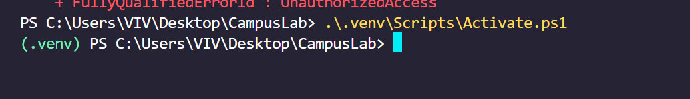

```cmd
django-admin startapp accounts
```


`views.py` es el controlador, vistas del modelo es html


> [!WARNING]
> NO usar vistas basadas en funciones. Sino basadas en CLASES


```py
urlpatterns = [
    path('admin/', admin.site.urls),
    path('accounts/', include('apps.accounts')),
]
```

Lo que hace la palabra include, es que todo lo que escriba en `accounts/urls.py`, me lo cargue. Le digo la carpeta que quiero que incluya. Eso lo concatena

En `accounts/urls.py`:
```py
urlpatterns = [
    path('admin/', admin.site.urls),
    path('accounts/', include('apps.accounts')),
]
```

> [!IMPORTANT]
> Hay que crear el archivo, `urls.py`, no se crea por defecto

> [!TIP] TIP | Solucion a un error
> Estaba teniendo el error 'Import "apps.accounts.views" could not be resolvedPylancereportMissingImports', porque no habia creado accounts, dentro de la carpeta app. El comando, no estaba bien puesta lña ruta, y yo no lo ejecuté desde apps.

> [!IMPORTANT] 35.00 DEBUGGER


Le dió error, hay que crear un json file para ejecutar el debugger
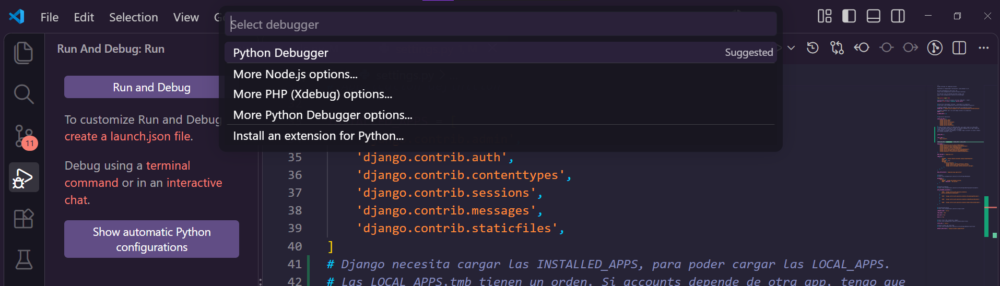
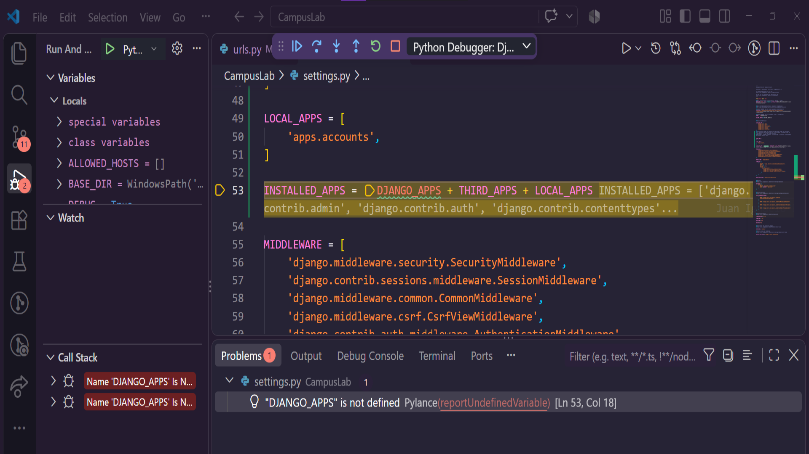

me salieron los logs! COMMIT: a168f9299cb413d388763ac69a28fc2acc37f741
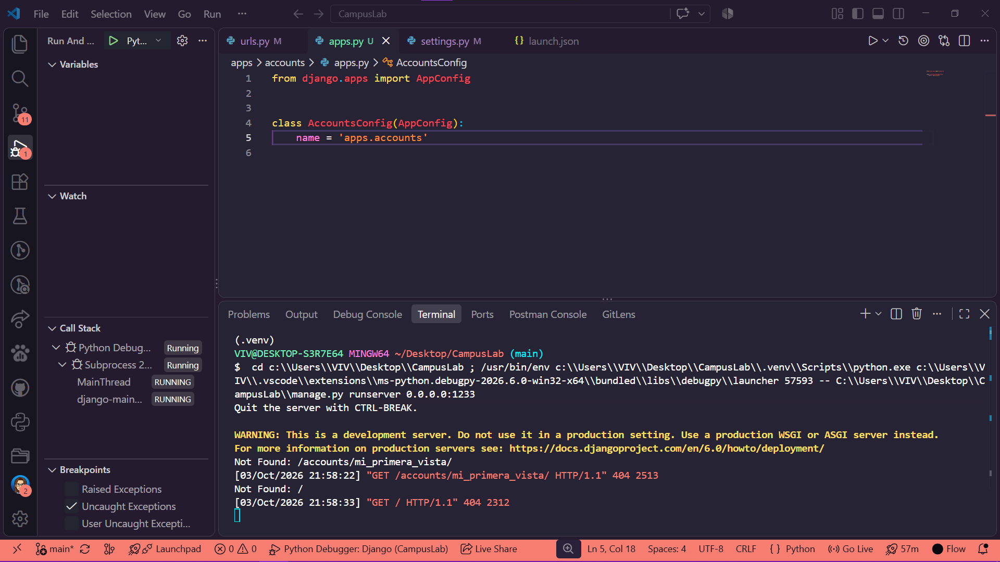

PERO NO ME LLEVÓ A LA VISTA
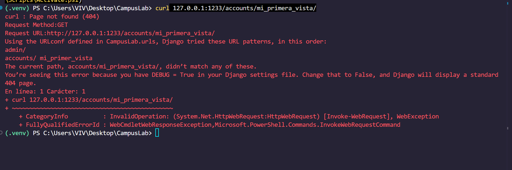

> [!IMPORTANT] Important | 
estaba poniendo mal el CURL
```cmd
curl 127.0.0.1:1233/accounts/mi_primer_vista
```
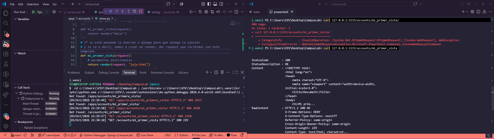


https://youtu.be/vfF_z0t5Zow?si=ANKeIck3cxZNx5oi&t=2832
1.00.00
https://youtu.be/vfF_z0t5Zow?si=mbJsCBF22pAp1gf-&t=3924


empieza de cero de nuevo
https://youtu.be/vfF_z0t5Zow?si=mX03R1NOR-Pu-J71&t=3088

> [!WARNING] Warning | REVISAR LO DE LAS MIGRACIONES, NO ME ACUERDO QUÉ ES


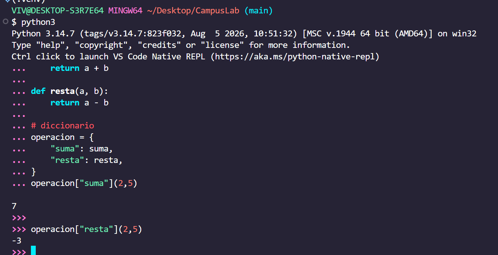
Tengo que tener prendido el debugger 1.10.0
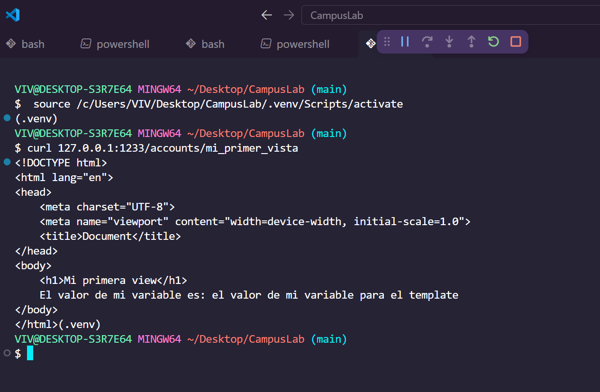


De `CampusLab/urls.py` de la raiz, tengo configurada la ruta `/accounts/`, en la app "accounts", de ahi se va al `./apps/accounts/urls.py`, a buscar qué tiene que hacer con esta ruta. 

Cuando la ruta matchea, django dice, tengo que ejecutar esta funcion, que se llama `mi_primer_vista` y ahí ejecita la lógica que escribimos. La lógica es el render

allí se encuentra que para la url solicitada, tiene que renderizar el template `mi_primer_vista`, con los datos pasados en el `context`

> [!IMPORTANT] Important | Carpeta templates 1.16.00
No tengo que pasar templates en la ruta de `./apps/accounts/urls.py` porque eso está configurado en `CampusLab/settings.py` 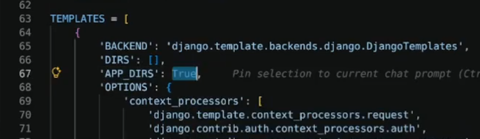

El template, en este caso `jaja.html`, renderiza dinamicamente html, con un for, y renderizando la variable suelta. 


### Modelos 1.19.00
`apps/accounts/models.py`

lOS MODELOS en django se representan con clases 
Un modelo es una tabla
Un campo es un atributo del modelo

```py
from django.db import models

from django.contrib.auth.models import AbstractUser

# Create your models here.

# CustomUser
# StudentProfile

class CustomUser(models.AbstractUser):
    pass

# Este va a estar relacionado con CustomUser
class StudentProfile(models.Model): # tabla - StudentProfile
    bio = models.CharField(max_length=255) # campo - bio

```

> [!IMPORTANT] Important | 1.23.0 Migraciones migrate
> Para aplicar migraciones, django tiene un sistema. Nosotros lo vamos a hacer con pytohn3
> MIGRATE APLICA/GENERA la MIGRACION
```cmd
python3 manage.py migrate 
```
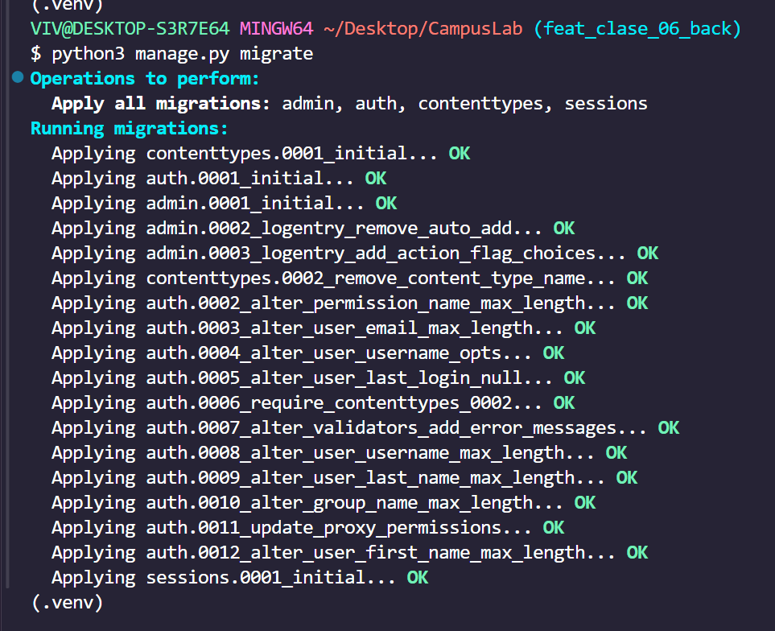

### La documentacion oficial dice que para poder cambiar el usuario, un nuevo CustomUser, le tengo que decir la "app.El modelo que reemplazo"
En `CampusLab/settings.py`:
```py
AUTH_USER_MODEL = "accounts.CustomUser"
```

Estoy extendiendo el usuario de django
    # Lo extiendo para poder agregarlo mis propios atributos y métodos AL MODELO USER DE DJANGO

```py
from django.db import models
from django.contrib.auth.models import AbstractUser

# CustomUser
# StudentProfile

class CustomUser(AbstractUser): # Estoy extendiendo el usuario de django
    # Lo extiendo para poder agregarlo mis propios atributos y métodos AL MODELO USER DE DJANGO
    phone_number = models.CharField(max_length=255) # campo - phone_number

# Este va a estar relacionado con CustomUser
class StudentProfile(models.Model): # tabla - StudentProfile
    bio = models.CharField(max_length=255) # campo - bio
```

> [!NOTE] Migrations
> MIGRATIONS CREA la MIGRACION
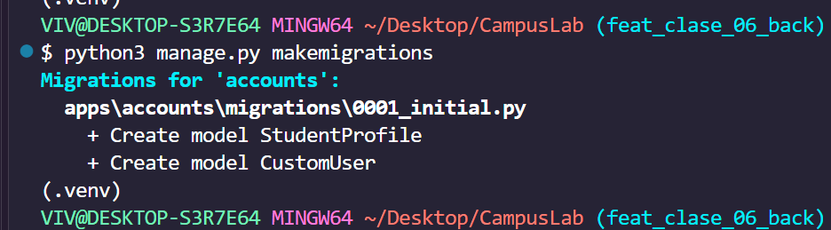
```cmd
python3 manage.py makemigrations
```
> [!NOTE] Esto genera el archivo de MIGRACIONES
> 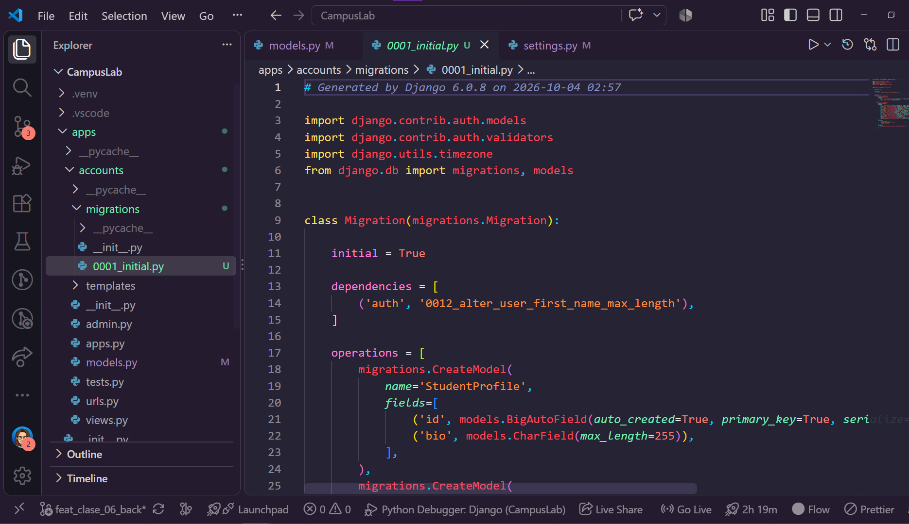


### Vista a la bdd sqlite3
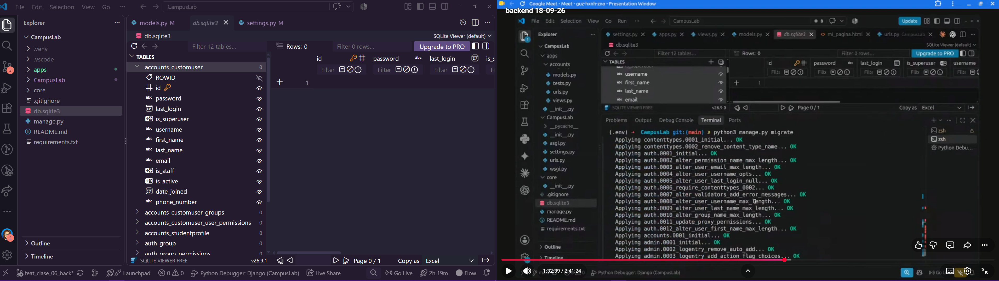

/ ******************************* /
Lo 1° que hay que hacer cuando trabajamos con django, es extender el custom user, por las migraciones
/ ******************************* /


¿Quién administra el usuario en django?
¿Quien se encarga de crear la sesion del usuario en django?

1.40.0
### RELACIONES SQL, RELACIONAR LAS TABLAS


``
```cmd

```

> [!NOTE] Note |

> [!WARNING] Warning |

> [!IMPORTANT] Important | 

> [!TIP] TIP |