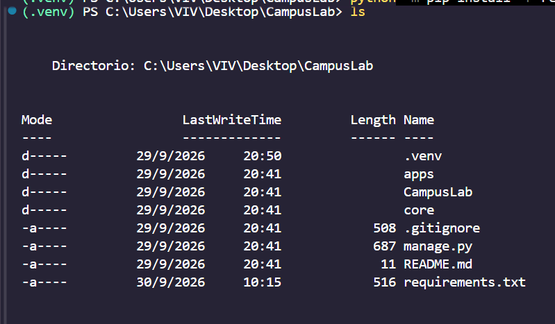
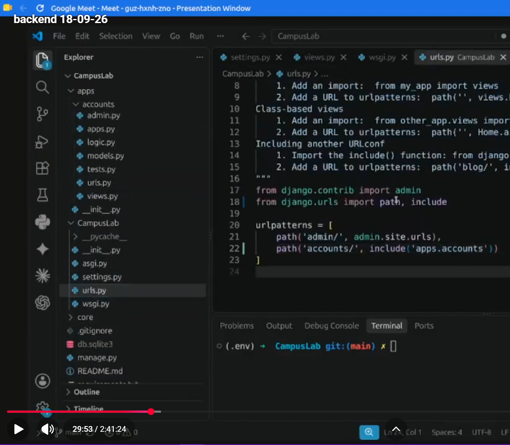
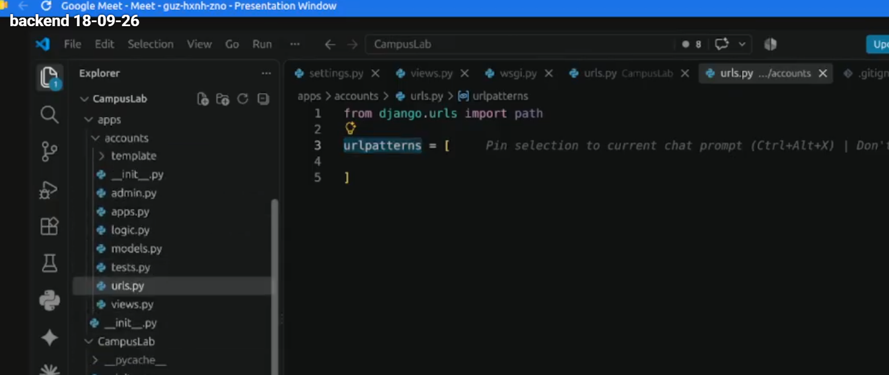
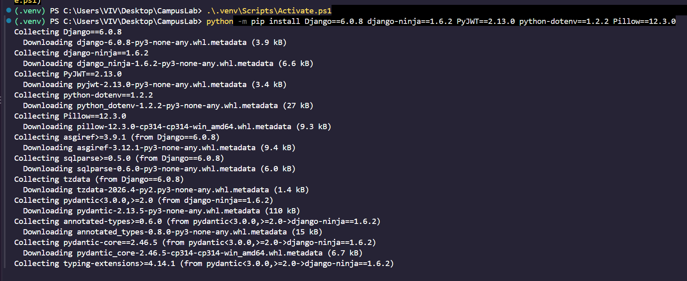
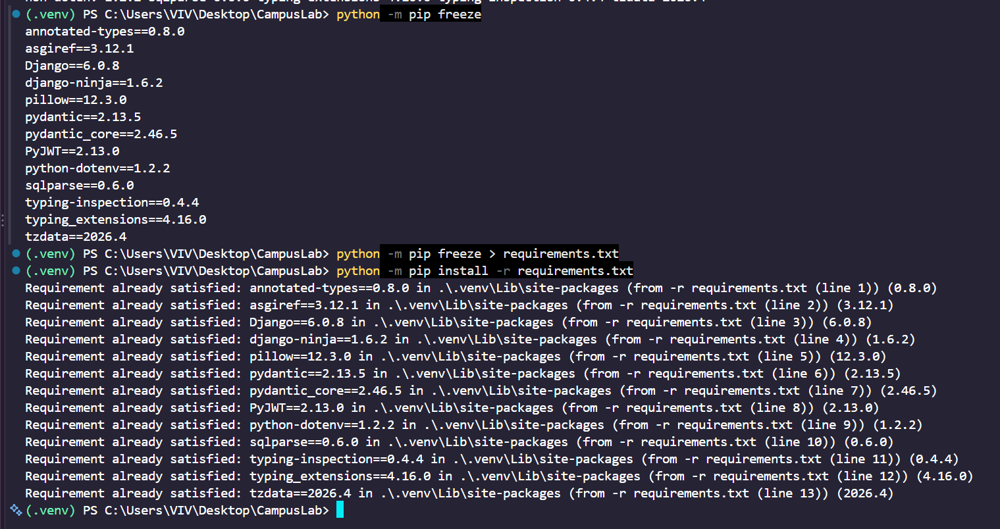

# Notas clase 06


```cmd
ls
```


Son iguales
```cmd
python3 manage.py startproject

django-admin startproject
```

Este comando lo corre desde la ruta principal, la raiz del proyecto
```cmd
python3 manage.py run server 0.0.0.0.1233
```

Este comando lo corre desde la ruta principal, la raiz del proyecto
```cmd
django-admin run server 0.0.0.0.1233
```

> [!NOTE] DJANGO ADMIN
> django-admin funciona para la creacion inicial del proyecto

django-admin es un patrón de diseño de  arquitectura, que se llama MVP, calco de MVC. Modelo Vista Controlador. 

> [!CAUTION] DUDA
> para cuando python3 manager y para cuando django admin


> [!NOTE] Note | MVC, MVT 

- MVC --> Model View Controller
- MVT --> Model View Template

- Modelo: Se almacena lógica a la creacion de tablas, columnas, etc
- Vista: Logica de  mostrar o generar el html
- Controlador: Lógica de negocio (relacionado a la lógica de la empresa, cómo se hacen las cosas. es mas decicsion, más humano)

Si crece mucho, se puede sacar aparte en `logic.py` dentro del módulo.
Lo ORQUESTA la view. Cuando queremos buscar lógica, se va a la view. 

> [!WARNING] Warning | IMPORTANTISIMO Flujo de DJANGO
> Todo en django arranca en .env > lib > django > 
> Django lo que hace es agarra su proyecto y arriba de estas funcionalidades le aplica lo que nosotros escribimos. Es cómo un callback 

Lo primero que hace una persona es ingresar a nuestra vista, django funciona como un orquestador, django está escuchando. 
> [!NOTE] Note | ¿Quién está escuchando?
> `asgi.py` o `wsgi.py`, dependiendo del servidor interno que estemos hablando

Nosotros no lo usamos, lo usa django. Lo disponibilizan afuera en estos archivos, por si queremos hacer algo afuera, a nivel de lo primero que entra en django, va a pasar por ahi, por esos archivos. ahi levanta la app. Y esto va a correr, cuando le decimos al servidor, quedate escuchando y levantame el servidor, el run server, entra por ahí. 

Una vez que se queda escuchando, empieza a redirigir desde `urls.py` a las urls que tengamos configuradas. En `urlpatterns`, cuando quiera buscar la url de cada una de mis apps, que vendrian a ser cómo módulos.





```cmd

```

# Proyecto - 2
# Crear y activar el entorno virtual

Un entorno virtual es una copia liviana del intérprete de Python con su propia carpeta de paquetes. 

Sin entorno virtual, todo lo que instales queda en el Python del sistema y compartido con cualquier otro proyecto: dos trabajos que necesiten versiones distintas de Django se pisan, y arreglar uno rompe el otro. 

El módulo venv viene incluido en Python, no hay que instalarlo.

> Crear el entorno no es usarlo. Son dos pasos distintos. Crear y activar

Activarlo es lo que hace que python y pip apunten a ese entorno y no al del sistema.

La activación pone la carpeta del entorno adelante de todo en el PATH, que es la lista de lugares donde la terminal busca los programas que le pedís. Por eso a partir de ahí python encuentra primero el del entorno.

La señal de que está activo es que el prompt de la terminal pasa a mostrar (.venv) adelante.

- La activación vale para esa terminal y nada más.
- La carpeta .venv no se sube al repositorio
- Lo que se versiona es la receta

> [!NOTE] Note | Get-ChildItem -Force
> Con `Get-ChildItem -Force` (powershell) se ve la carpeta .git

```cmd
py install 3.14

# Crear
py -3.14 -m venv .venv
# Activar
.\.venv\Scripts\Activate.ps1
# Comprobar
Get-Command python
```

> [!IMPORTANT] Importante - Error
> Obtuve este error y lo solucioné con este enlace:
> - https://es.stackoverflow.com/questions/321611/problema-con-scripts-en-visual-studio-code
>
> 
> 

Luego de tirar ese comando, la consola salió bien, el paso de Activar y Comprobar


Con esto tambien se solucionaba
```cmd
Set-ExecutionPolicy -Scope Process Bypass
```

### Qué python se usa.

> [!IMPORTANT]
> Django 6 exige Python 3.12 o superior

```cmd
python --version
```

# Proyecto - 3 
# Instalar las dependencias y congelarlas


pip es el instalador de paquetes de Python: recibe un nombre, lo busca en `PyPI (Python Package Index, el repositorio público donde la comunidad publica sus paquetes)`, lo descarga junto con las dependencias que ese paquete necesite y lo deja dentro del entorno activo.

> [!WARNING] Warning | Precaución pip freeze
> Lo invocamos como `python -m pip` y **no** como `pip` a secas por una razón concreta: 
> 
> `python -m pip` usa el pip del python que está activo, mientras que pip suelto puede ser cualquier otro que ande dando vueltas en el sistema.
> 
>  Es la diferencia entre instalar en el entorno y creer que instalaste en el entorno.


- `Django` (el framework)
- `django-ninja` (la capa de API, con validación y documentación automática)
- `PyJWT` (firma y verificación de los tokens), python-dotenv (el que lee el archivo .env con la configuración propia de cada máquina)
- `Pillow` (la biblioteca de imágenes de Python, que Django exige para usar un ImageField).


Instalar no alcanza: lo que instalaste vive adentro de .venv, que no se sube al repositorio. Si tu compañero clona el proyecto, se encuentra con el código y sin una sola dependencia. 

Lo que `se versiona` es `la lista`, y esa lista es `requirements.txt`: un `archivo de texto con un paquete por renglón` y su `versión exacta`, en el formato que entiende `pip install -r`
```cmd
pip install -r

pip freeze # mira el entorno activo y escribe todo lo que hay instalado con la versión exacta de cada cosa
```

El archivo se genera con
```cmd
python -m pip freeze > requirements.txt
```


> [!NOTE] Note | Operador >
> el > es el operador de la terminal que redirige esa salida a un archivo en vez de mostrarla en pantalla

- Leer el archivo de dependencias
```cmd
python -m pip install -r requirements.txt
```
es también lo que va a correr Docker más adelante.

> [!IMPORTANT]
> cada vez que instales algo nuevo, volvé a generar el archivo

1) Instalá. 
Las cinco dependencias con la versión fijada, en un solo comando. Antes de correrlo, comprobá que el entorno esté activo: el prompt tiene que mostrar (.venv).
```cmd
python -m pip install Django==6.0.8 django-ninja==1.6.2 PyJWT==2.13.0 python-dotenv==1.2.2 Pillow==12.3.0
```


2) Mirá qué quedó. 
python -m pip freeze sin nada más, para ver en pantalla lo que se va a escribir. Van a aparecer más paquetes de los cinco que instalaste: son las dependencias que ellos arrastran.
```cmd
python -m pip freeze
```

3) Congelá. 
Ahora sí, con > requirements.txt al final, para que esa salida vaya a un archivo en la raíz del proyecto.
```cmd
python -m pip freeze > requirements.txt
```

4) Abrí el archivo. 
Fijate que cada renglón tenga la forma paquete==version. Ninguno tiene que quedar sin versión.
```cmd
python -m pip install -r requirements.txt
```

5) Probá el camino de vuelta.
 No va a instalar nada, porque ya está todo: eso es exactamente lo que tiene que pasar, y confirma que el archivo se entiende.
```cmd
python -m pip install -r requirements.txt
```


DJANGO NINJA es el framework a usar para hacer aps


# Proyecto - 4 
# Crear el proyecto con startproject

`django-admin` es la herramienta de línea de comandos que quedó instalada junto con Django. 
- startproject genera el esqueleto de configuración: 
  - `settings.py` (los ajustes del proyecto), 
  - `urls.py` (el mapa de rutas), 
  - `wsgi.py` y 
  - `asgi.py` (los puntos de entrada que usan los servidores) y 
  - `manage.py .` # El punto final del comando no es un detalle: sin él, Django agrega una carpeta contenedora extra y te deja el proyecto un nivel más adentro.

> [!IMPORTANT] 
> De acá en adelante ya no usamos django-admin sino manage.py, que hace lo mismo pero sabiendo cuál es el settings.py de este proyecto.

```cmd
django-admin startproject CampusLab .

```


```cmd

```