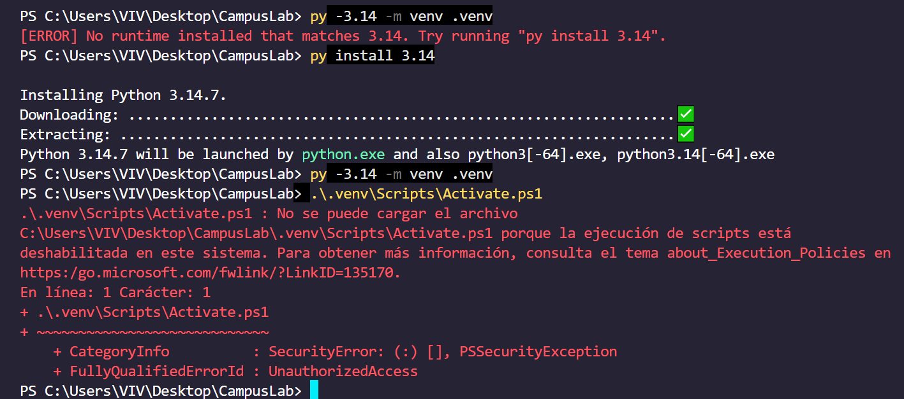
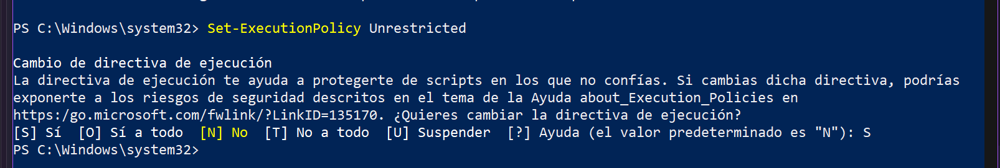
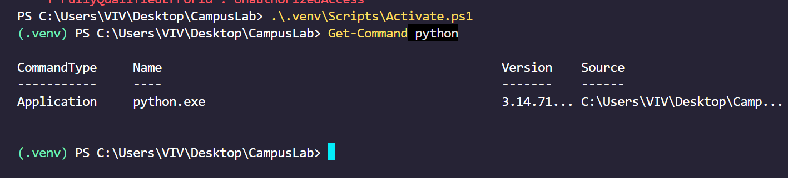
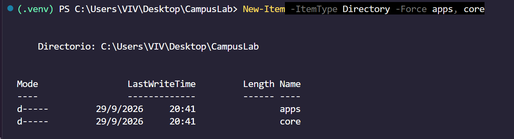
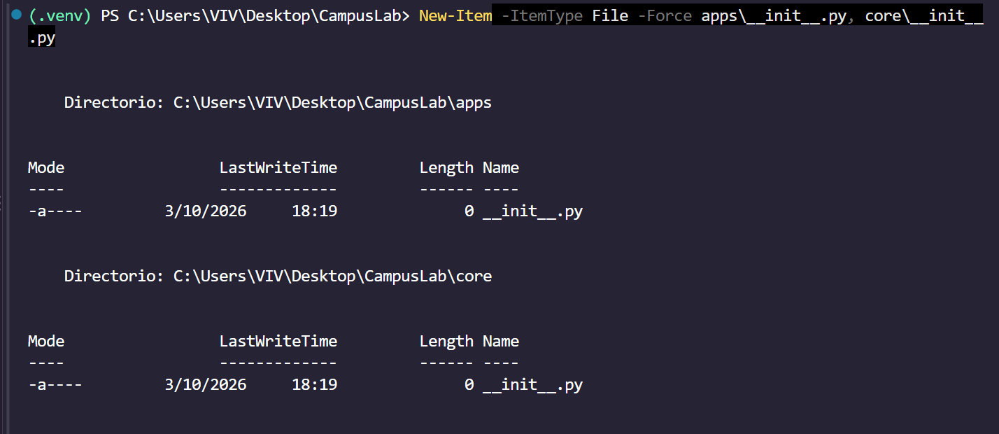

# Proyecto - 2
# Crear y activar el entorno virtual

Un entorno virtual es una copia liviana del intérprete de Python con su propia carpeta de paquetes. 

Sin entorno virtual, todo lo que instales queda en el Python del sistema y compartido con cualquier otro proyecto: dos trabajos que necesiten versiones distintas de Django se pisan, y arreglar uno rompe el otro. 

El módulo venv viene incluido en Python, no hay que instalarlo.

> Crear el entorno no es usarlo. Son dos pasos distintos. Crear y activar

Activarlo es lo que hace que python y pip apunten a ese entorno y no al del sistema.

La activación pone la carpeta del entorno adelante de todo en el PATH, que es la lista de lugares donde la terminal busca los programas que le pedís. Por eso a partir de ahí python encuentra primero el del entorno.

La señal de que está activo es que el prompt de la terminal pasa a mostrar (.venv) adelante.

- La activación vale para esa terminal y nada más.
- La carpeta .venv no se sube al repositorio
- Lo que se versiona es la receta

> [!NOTE] Note | Get-ChildItem -Force
> Con `Get-ChildItem -Force` (powershell) se ve la carpeta .git

> [!IMPORTANT]
> HACER ESTO CADA VEZ QUE ABRO LA TERMINAL


```cmd
py install 3.14

# Crear
py -3.14 -m venv .venv
# Activar
.\.venv\Scripts\Activate.ps1
# Comprobar
Get-Command python
```

> [!IMPORTANT] Importante - Error
> Obtuve este error y lo solucioné con este enlace:
> - https://es.stackoverflow.com/questions/321611/problema-con-scripts-en-visual-studio-code
>
> 
> 

Luego de tirar ese comando, la consola salió bien, el paso de Activar y Comprobar



Con esto tambien se solucionaba
```cmd
Set-ExecutionPolicy -Scope Process Bypass
```

### Qué python se usa.

> [!IMPORTANT]
> Django 6 exige Python 3.12 o superior

```cmd
python --version
```

# Proyecto - 3 
# Instalar las dependencias y congelarlas


pip es el instalador de paquetes de Python: recibe un nombre, lo busca en `PyPI (Python Package Index, el repositorio público donde la comunidad publica sus paquetes)`, lo descarga junto con las dependencias que ese paquete necesite y lo deja dentro del entorno activo.

> [!WARNING] Warning | Precaución pip freeze
> Lo invocamos como `python -m pip` y **no** como `pip` a secas por una razón concreta: 
> 
> `python -m pip` usa el pip del python que está activo, mientras que pip suelto puede ser cualquier otro que ande dando vueltas en el sistema.
> 
>  Es la diferencia entre instalar en el entorno y creer que instalaste en el entorno.


- `Django` (el framework)
- `django-ninja` (la capa de API, con validación y documentación automática)
- `PyJWT` (firma y verificación de los tokens), python-dotenv (el que lee el archivo .env con la configuración propia de cada máquina)
- `Pillow` (la biblioteca de imágenes de Python, que Django exige para usar un ImageField).


Instalar no alcanza: lo que instalaste vive adentro de .venv, que no se sube al repositorio. Si tu compañero clona el proyecto, se encuentra con el código y sin una sola dependencia. 

Lo que `se versiona` es `la lista`, y esa lista es `requirements.txt`: un `archivo de texto con un paquete por renglón` y su `versión exacta`, en el formato que entiende `pip install -r`
```cmd
pip install -r

pip freeze # mira el entorno activo y escribe todo lo que hay instalado con la versión exacta de cada cosa
```

El archivo se genera con
```cmd
python -m pip freeze > requirements.txt
```


> [!NOTE] Note | Operador >
> el > es el operador de la terminal que redirige esa salida a un archivo en vez de mostrarla en pantalla

- Leer el archivo de dependencias
```cmd
python -m pip install -r requirements.txt
```
es también lo que va a correr Docker más adelante.

> [!IMPORTANT]
> cada vez que instales algo nuevo, volvé a generar el archivo

1) Instalá. 
Las cinco dependencias con la versión fijada, en un solo comando. Antes de correrlo, comprobá que el entorno esté activo: el prompt tiene que mostrar (.venv).
```cmd
python -m pip install Django==6.0.8 django-ninja==1.6.2 PyJWT==2.13.0 python-dotenv==1.2.2 Pillow==12.3.0
```


2) Mirá qué quedó. 
python -m pip freeze sin nada más, para ver en pantalla lo que se va a escribir. Van a aparecer más paquetes de los cinco que instalaste: son las dependencias que ellos arrastran.
```cmd
python -m pip freeze
```

3) Congelá. 
Ahora sí, con > requirements.txt al final, para que esa salida vaya a un archivo en la raíz del proyecto.
```cmd
python -m pip freeze > requirements.txt
```

4) Abrí el archivo. 
Fijate que cada renglón tenga la forma paquete==version. Ninguno tiene que quedar sin versión.
```cmd
python -m pip install -r requirements.txt
```

5) Probá el camino de vuelta.
 No va a instalar nada, porque ya está todo: eso es exactamente lo que tiene que pasar, y confirma que el archivo se entiende.
```cmd
python -m pip install -r requirements.txt
```


DJANGO NINJA es el framework a usar para hacer aps


# Proyecto - 4 
# Crear el proyecto con startproject

`django-admin` es la herramienta de línea de comandos que quedó instalada junto con Django. 
- startproject genera el esqueleto de configuración: 
  - `settings.py` (los ajustes del proyecto), 
  - `urls.py` (el mapa de rutas), 
  - `wsgi.py` y 
  - `asgi.py` (los puntos de entrada que usan los servidores) y 
  - `manage.py .` # El punto final del comando no es un detalle: sin él, Django agrega una carpeta contenedora extra y te deja el proyecto un nivel más adentro.

> [!IMPORTANT] 
> De acá en adelante ya no usamos django-admin sino manage.py, que hace lo mismo pero sabiendo cuál es el settings.py de este proyecto.

```cmd
django-admin startproject CampusLab .

```

# Proyecto - 5 
# Crear apps y core

> [!IMPORTANT] Important | archivo `__init__.py`

En Python, `una carpeta` pasa a ser un `paquete importable` cuando contiene un archivo `__init__.py`, **aunque esté vacío**. 
Eso es lo que va a permitir escribir más adelante from apps.accounts.models import User.


| carpeta | uso                                                                                           |
| ------- | --------------------------------------------------------------------------------------------- |
| apps    | para separar el código del dominio de la configuración del proyecto                           |
| core    | para lo que van a compartir varias apps, que en este caso es la parte de JWT y autenticación. |

> [!IMPORTANT] Important | imports internos - ABSOLUTOS

En todo el proyecto los imports internos son absolutos: siempre se escribe la ruta completa desde la raíz (from apps.accounts.models import User, from core.jwt import decode_token) y nunca la forma relativa con puntos (from .models import User).

Es lo que recomienda la PEP 8 y tiene una ventaja práctica: la línea significa lo mismo la leas desde donde la leas, así que se puede copiar de un archivo a otro sin retocarla y de un vistazo se sabe de qué app sale cada cosa.

> [!NOTE] Las carpetas se pueden crear a mano o por línea de comandos

```cmd
New-Item -ItemType Directory -Force apps, core
New-Item -ItemType File -Force apps\__init__.py, core\__init__.py
```





# Proyecto - 6 
# El modelo de datos, de un vistazo

> [!IMPORTANT] Modelo de negocio del BANCO DE PROYECTOS

El sistema es un Banco de Proyectos: 
la vidriera donde las instituciones muestran los trabajos que hicieron sus alumnos.

Esta guía construye su primera etapa, que es el circuito de adentro: 

1) La institución habilita a sus docentes, 
2) el docente abre sus cursadas, 
   1) carga a sus alumnos y sube el proyecto de cada equipo, 
3) la institución lo aprueba (o lo carga ella misma, ya aprobado). 
4) Lo aprobado queda en un catálogo que cualquiera puede recorrer sin tener cuenta.

Lo que viene después (las entidades que se interesan en un trabajo, el contacto que media la institución, las oportunidades y el material de capacitación) es la segunda etapa y no está acá.

- Los actores son dos: la institución y el docente. 
- El alumno no tiene cuenta: no inicia sesión y no carga nada. Es un dato que el docente carga para poder decir quién hizo cada trabajo. 
- El proyecto lo sube el docente de la cursada, o la institución misma; el alumno, nunca. 
- El administrador acompaña a los dos, pero no es un actor del dominio: es la cuenta que entra al admin de Django a cargar tecnologías o a dar de alta una institución.


Son cinco apps y catorce modelos. Cada modelo es una tabla de la base, y está porque hay una pregunta que el sistema no puede responder sin él.

###  ¿Qué es una app?
> [!NOTE] Note | ¿Qué es una app?
> es la unidad con la que Django organiza todo.

Una app es una carpeta que es un paquete de Python, con su `models.py` adentro; un `modelo` pertenece a una sola app, y una app suele tener varios. Agrupar dos modelos en la misma app es afirmar algo: que cambian por el mismo motivo. 

Por eso los participantes de un proyecto están en projects junto al proyecto, y el alumno está en academics junto a la cursada en la que se lo inscribe.

> [!WARNING] Warning |  Criterio para separar 2 apps
>  ¿esto puede existir por su cuenta?

El criterio para separarlas es una sola pregunta: ¿esto puede existir por su cuenta? Una institución existe aunque no haya un solo proyecto cargado, así que tiene app propia. Un participante de un proyecto no existe sin el proyecto: nace y muere con él, así que vive adentro de la misma app. En el paso 7 está el detalle app por app; acá alcanza con leer la tabla sabiendo qué significa cada fila.

> [!WARNING] Warning | Duda sobre los endpoints CIRCULARES
> Un detalle que se nota al escribir el código: cuando un modelo apunta a otro de su misma app se lo nombra pelado (Career), y cuando apunta a otra app se lo nombra con el prefijo ("institutions.Institution", entre comillas). Esa comilla no es capricho: permite que dos apps se apunten sin importarse la una a la otra, que es lo que evita los imports circulares.


```cmd

```
