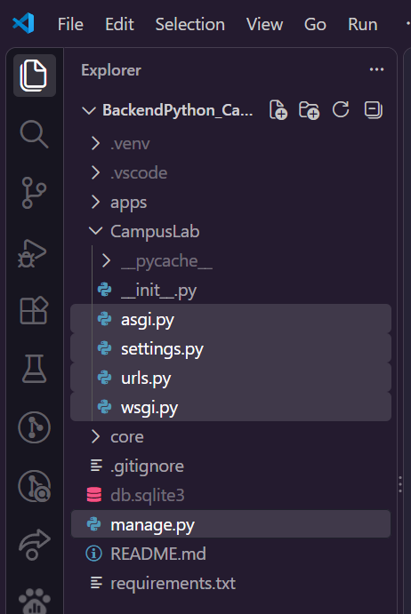
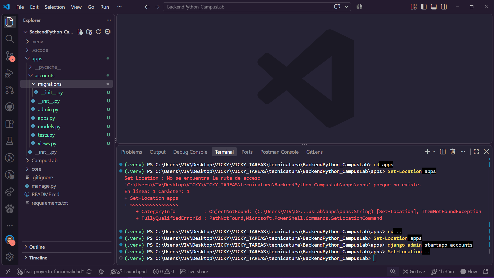
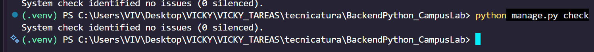
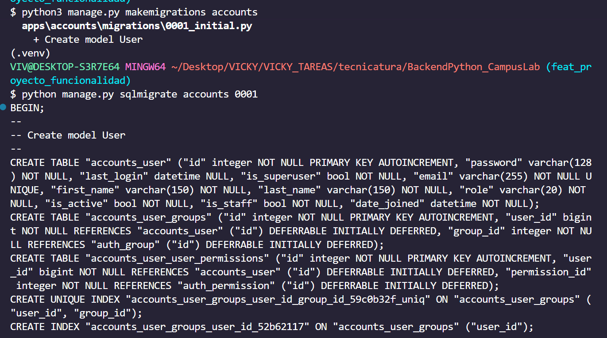
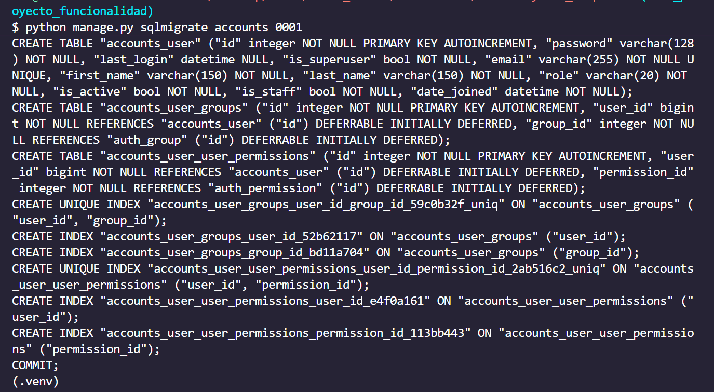
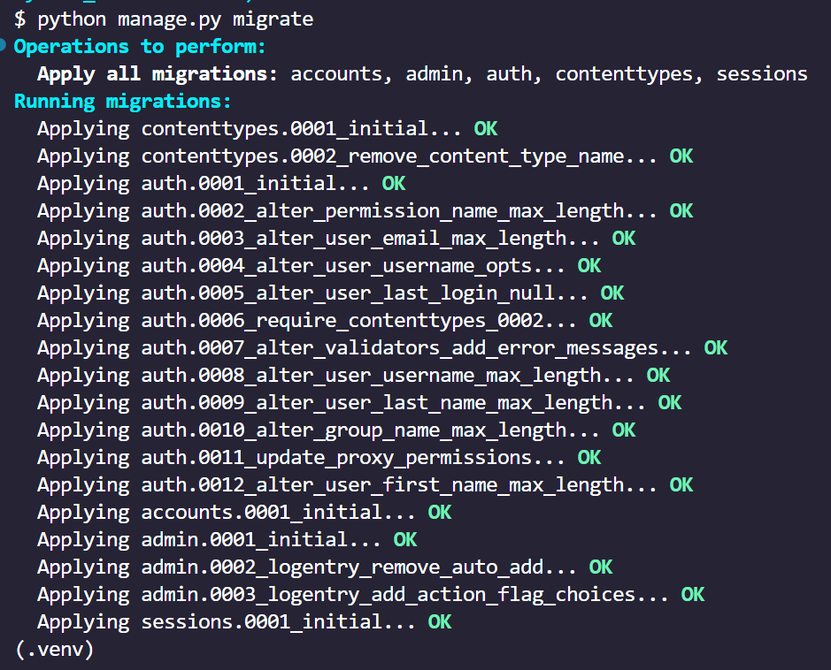

# Proyecto - 2
# Crear y activar el entorno virtual

Un entorno virtual es una copia liviana del intérprete de Python con su propia carpeta de paquetes. 

Sin entorno virtual, todo lo que instales queda en el Python del sistema y compartido con cualquier otro proyecto: dos trabajos que necesiten versiones distintas de Django se pisan, y arreglar uno rompe el otro. 

El módulo `venv` viene incluido en Python, no hay que instalarlo.

> Crear el entorno no es usarlo. Son dos pasos distintos. Crear y activar

> Activarlo es lo que hace que python y pip apunten a ese entorno y no al del sistema.

La activación pone la carpeta del entorno adelante de todo en el PATH, que es la lista de lugares donde la terminal busca los programas que le pedís. Por eso a partir de ahí python encuentra primero el del entorno.

> [!TIP] La señal de que está activo es que el prompt de la terminal pasa a mostrar (.venv) adelante.

- La activación vale para esa terminal y nada más.
- La carpeta .`venv` no se sube al repositorio
- Lo que se versiona es la receta

> [!NOTE] Note | Get-ChildItem -Force
> Con `Get-ChildItem -Force` (powershell) se ve la carpeta .git

> [!IMPORTANT] Important | Pasos para Crear, activar y comprobar que se creó el entorno virtual
> HACER ESTO CADA VEZ QUE ABRO LA TERMINAL
```cmd
py install 3.14

# Crear
py -3.14 -m venv .venv
# Activar
.\.venv\Scripts\Activate.ps1
# Comprobar
Get-Command python
```

> [!IMPORTANT] Importante - Error
> Obtuve este error y lo solucioné con este enlace:
> - https://es.stackoverflow.com/questions/321611/problema-con-scripts-en-visual-studio-code
>
> 
> 

Luego de tirar ese comando, la consola salió bien, el paso de Activar y Comprobar


Con esto tambien se solucionaba
```cmd
Set-ExecutionPolicy -Scope Process Bypass
```

### Qué python se usa.

> [!IMPORTANT]
> Django 6 exige Python 3.12 o superior

```cmd
python --version
```

## Teoría 2
## Por qué un entorno virtual, y qué es exactamente
Un entorno virtual es, sencillamente, una carpeta con su propio site-packages y un intérprete que sabe mirarlo primero.

Activar el entorno no instala nada ni cambia tu Python: lo único que hace es poner la carpeta .venv\Scripts\ al principio del PATH de esa terminal. Por eso python y pip pasan a ser los del entorno, por eso el prompt muestra (.venv), y por eso hay que volver a activarlo en cada terminal nueva: es un cambio de esa sesión, no de la máquina.

# Proyecto - 3 
# Instalar las dependencias y congelarlas


pip es el instalador de paquetes de Python: recibe un nombre, lo busca en `PyPI (Python Package Index, el repositorio público donde la comunidad publica sus paquetes)`, lo descarga junto con las dependencias que ese paquete necesite y lo deja dentro del entorno activo.

> [!WARNING] Warning | Precaución pip freeze
> Lo invocamos como `python -m pip` y **no** como `pip` a secas por una razón concreta: 
> 
> `python -m pip` usa el pip del python que está activo, mientras que pip suelto puede ser cualquier otro que ande dando vueltas en el sistema.
> 
>  Es la diferencia entre instalar en el entorno y creer que instalaste en el entorno.


- `Django` (el framework)
- `django-ninja` (la capa de API, con validación y documentación automática)
- `PyJWT` (firma y verificación de los tokens), 
- `python-dotenv` (el que lee el archivo .env con la configuración propia de cada máquina)
- `Pillow` (la biblioteca de imágenes de Python, que Django exige para usar un ImageField).


Instalar no alcanza: lo que instalaste vive adentro de .venv, que no se sube al repositorio. Si tu compañero clona el proyecto, se encuentra con el código y sin una sola dependencia. 

Lo que `se versiona` es `la lista`, y esa lista es `requirements.txt`: un `archivo de texto con un paquete por renglón` y su `versión exacta`, en el formato que entiende `pip install -r`

> [!TIP] TIP | Generar el requirements.txt
```cmd
pip install -r

pip freeze # mira el entorno activo y escribe todo lo que hay instalado con la versión exacta de cada cosa
```

El archivo se genera con
```cmd
python -m pip freeze > requirements.txt
```


> [!NOTE] Note | Operador >
> el > es el operador de la terminal que redirige esa salida a un archivo en vez de mostrarla en pantalla

- Leer el archivo de dependencias (python -m pip install -r requirements.txt
)
```cmd
python -m pip install -r requirements.txt
```
es también lo que va a correr Docker más adelante.

> [!IMPORTANT]
> cada vez que instales algo nuevo, volvé a generar el archivo

1) Instalá. 
Las cinco dependencias con la versión fijada, en un solo comando. Antes de correrlo, comprobá que el entorno esté activo: el prompt tiene que mostrar (.venv).
```cmd
python -m pip install Django==6.0.8 django-ninja==1.6.2 PyJWT==2.13.0 python-dotenv==1.2.2 Pillow==12.3.0
```


2) Mirá qué quedó. 
python -m pip freeze sin nada más, para ver en pantalla lo que se va a escribir. Van a aparecer más paquetes de los cinco que instalaste: son las dependencias que ellos arrastran.
```cmd
python -m pip freeze
```

3) Congelá. 
Ahora sí, con > requirements.txt al final, para que esa salida vaya a un archivo en la raíz del proyecto.
```cmd
python -m pip freeze > requirements.txt
```

4) Abrí el archivo. 
Fijate que cada renglón tenga la forma paquete==version. Ninguno tiene que quedar sin versión.
```cmd
python -m pip install -r requirements.txt
```

5) Probá el camino de vuelta.
 No va a instalar nada, porque ya está todo: eso es exactamente lo que tiene que pasar, y confirma que el archivo se entiende.
```cmd
python -m pip install -r requirements.txt
```


> DJANGO NINJA es el framework a usar para hacer aps

## Teoría 3
## pip, PyPI y la lista de dependencias
PyPI (Python Package Index) es el repositorio público donde cualquiera publica paquetes de Python, y pip es el programa que los busca ahí, los baja y los instala.

Cuando pedís un paquete, pip lee su metadata, ve de qué otros paquetes depende, los baja también, y así hasta que el árbol esté completo: por eso instalar cinco cosas deja quince en la lista.

Lo que instalaste vive adentro de .venv, y esa carpeta no se sube al repositorio.


# Proyecto - 4 
# Crear el proyecto con startproject

`django-admin` es la herramienta de línea de comandos que quedó instalada junto con Django. 
- `startproject` genera el esqueleto de configuración: 
  - `settings.py` (los ajustes del proyecto), 
  - `urls.py` (el mapa de rutas), 
  - `wsgi.py` y `asgi.py` (los puntos de entrada que usan los servidores) 
  - `manage.py .` # El punto final del comando no es un detalle: sin él, Django agrega una carpeta contenedora extra y te deja el proyecto un nivel más adentro.

> [!IMPORTANT] Important - Duda ¿Cuando va django-admin y cuando manage.py?
> De acá en adelante ya **no** usamos `django-admin` sino `manage.py`, que hace lo mismo pero sabiendo cuál es el settings.py de este proyecto.

Este comando tiene que generar:
En la raíz tienen que aparecer `manage.py` y la carpeta CampusLab/ con `settings.py`, `urls.py`, `asgi.py` y `wsgi.py`.
```cmd
django-admin startproject CampusLab .
```


## Teoría 4
## Qué es Django y qué genera `startproject`

> [!NOTE] Note | Framework vs biblioteca
> Django es un framework web escrito en Python. Una biblioteca es código que vos llamás cuando lo necesitás; un framework es al revés: trae la aplicación armada y te llama a vos en los lugares donde tenés que poner lo tuyo. 
> 
> Eso tiene un precio (hay que aprender dónde van las cosas y respetar sus convenciones) y un premio enorme: no escribís el servidor, ni el ruteo, ni el acceso a la base, ni el panel de administración, ni el sistema de usuarios y contraseñas. 
> 
> Django viene con las pilas puestas: eso quiere decir la frase batteries included con la que se lo describe.

> [!NOTE] Note | El camino de un pedido
> llega un `request HTTP`, el `URLconf (urls.py)` mira la ruta y elige qué función lo atiende, esa función (la vista) hace el trabajo (consultar o modificar datos con el `ORM`, que traduce entre objetos de Python y filas de la base) y devuelve un response.
> 
>  En un sitio clásico la vista devuelve `HTML` armado con un template; en esta guía devuelve `JSON`, porque estamos haciendo una `API` para que la consuman otros programas. 
> 
> A ese esquema Django lo llama `MTV` (modelo, template, vista), que es su manera de nombrar lo que en otros frameworks se llama MVC.

> [!NOTE] Note | Proyecto vs app
> Un proyecto Django se organiza en dos niveles, y la diferencia es la que más cuesta al principio. 
> 
> El `proyecto` es la `configuración`: el conjunto, lo que se despliega, lo que sabe con qué base hablar y qué rutas existen. 
> 
> Una `app` es un `pedazo de funcionalidad` con sus modelos y su código, que vive adentro del proyecto y que en teoría podrías llevarte a otro. 
> 
> Un proyecto con cinco apps, como este, es un proyecto con cinco responsabilidades separadas, no cinco programas. 
> 
> Lo que crea este paso es el proyecto; las apps empiezan en el paso 10.

> [!NOTE] Note | `django-admin`
> `es el programa de línea de comandos que quedó instalado junto con Django`, y `startproject` es el subcomando que crea el esqueleto. 
> 
> Son cinco archivos y ninguno es misterioso: conviene abrirlos y leerlos, porque son los que van a estar ahí durante todo el proyecto.

- `manage.py` es el que más vas a usar. Hace lo mismo que `django-admin`, con una diferencia clave: antes de nada define la variable de entorno `DJANGO_SETTINGS_MODULE` apuntando al` settings.py` de este proyecto. 
  
  Django no adivina su configuración: la busca en esa variable. Esa es toda la magia de manage.py, y por eso de acá en adelante todos los comandos empiezan con él: runserver, makemigrations, migrate, createsuperuser, test, shell.

- `settings.py` es un módulo de Python común y corriente donde cada ajuste es una variable en mayúsculas. 
  
  Que sea código y no un archivo de configuración tiene una consecuencia práctica linda: podés calcular valores, leer variables de entorno o armar rutas con BASE_DIR. 
  
  Viene con lo mínimo para arrancar (las apps de contrib, el middleware, la base SQLite, el idioma y la zona horaria) y en el paso 12 lo vas a modificar bastante.

- `urls.py` es el mapa de rutas del proyecto: una lista de patrones donde cada uno dice qué código atiende esa URL. Recién arranca con el admin; en el paso 55 le vas a colgar la API entera con una sola línea.

- `wsgi.py` y `asgi.py` son los puntos de entrada para un servidor de verdad. WSGI es el contrato entre un servidor Python (gunicorn, uWSGI) y tu aplicación: el servidor importa el objeto application de ese archivo y le pasa cada pedido. 
  
  ASGI es la versión asincrónica del mismo contrato, la que hace falta para WebSockets. En desarrollo no los usa nadie, porque runserver trae su propio servidor; en producción son la puerta de entrada, y en el paso 59 el Dockerfile va a apuntar justo ahí.

- El `__init__.py` vacío de la carpeta convierte a CampusLab/ en un paquete de Python importable: es lo que permite que `DJANGO_SETTINGS_MODULE` valga CampusLab.settings.

Con eso, la carpeta empieza a tener forma. Así va a quedar cuando el proyecto esté terminado:

banco-proyecto/            la raiz: la terminal siempre parada aca
|- manage.py               el comando con el que se opera el proyecto
|- CampusLab/              el paquete de configuracion del proyecto
|  |- __init__.py
|  |- settings.py          los ajustes: apps, base de datos, claves
|  |- urls.py              el mapa de rutas
|  |- asgi.py              punto de entrada asincronico
|  `- wsgi.py              punto de entrada para el servidor
|- apps/                   una carpeta por cada app del dominio
|  `- projects/
|     |- models.py         las tablas, como clases de Python
|     |- admin.py          que se ve y como en el panel de administracion
|     |- apps.py           la configuracion de la app
|     `- migrations/       el historial de cambios de sus tablas
|- core/                   lo que comparten varias apps
|- .venv/                  el entorno virtual (no se sube al repositorio)
`- db.sqlite3              la base de datos, un solo archivo

Vas a notar dos diferencias con el Django de manual, y las dos son a propósito. 
1) La primera: no hay views.py ni templates/, porque no devolvemos páginas; en su lugar cada app va a tener un api.py escrito con django-ninja, una biblioteca que se apoya en Django para escribir APIs con validación automática de lo que entra y sale. 
2) La segunda: cada app se abre en más archivos que los que crea Django (managers.py, selectors.py, services.py, schemas.py), y a eso está dedicado el paso 9.

Sólo devolvemos información, el otro IFTS lo renderiza


> [!NOTE] Note | 

# Proyecto - 5 
# Crear apps y core

> [!IMPORTANT] Important | archivo `__init__.py`
En Python, `una carpeta` pasa a ser un `paquete importable` cuando contiene un archivo `__init__.py`, **aunque esté vacío**. 
Eso es lo que va a permitir escribir más adelante from apps.accounts.models import User.


| carpeta | uso                                                                                           |
| ------- | --------------------------------------------------------------------------------------------- |
| apps    | para separar el código del dominio de la configuración del proyecto                           |
| core    | para lo que van a compartir varias apps, que en este caso es la parte de JWT y autenticación. |

> [!IMPORTANT] Important | imports internos - ABSOLUTOS
> **En todo el proyecto los imports internos son absolutos**: siempre se escribe la ruta completa desde la raíz (from apps.accounts.models import User, from core.jwt import decode_token) y nunca la forma relativa con puntos (from .models import User).
> 
> Es lo que recomienda la PEP 8 y tiene una ventaja práctica: la línea significa lo mismo la leas desde donde la leas, así que se puede copiar de un archivo a otro sin retocarla y de un vistazo se sabe de qué app sale cada cosa.

> [!NOTE] Las carpetas se pueden crear a mano o por línea de comandos

```cmd
New-Item -ItemType Directory -Force apps, core
New-Item -ItemType File -Force apps\__init__.py, core\__init__.py
```


## Teoría - 5
## Paquetes, módulos e imports en Python

- `Un módulo de Python` es un archivo .py. 
- `Un paquete es una carpeta que agrupa módulos` y que se puede importar como si fuera uno: 
apps/accounts/models
`apps.accounts.models` es el archivo `models.py `adentro de la carpeta `accounts`, adentro de la carpeta `apps`. 

# Proyecto - 6 
# El modelo de datos, de un vistazo

> [!IMPORTANT] Modelo de negocio del BANCO DE PROYECTOS

El sistema es un Banco de Proyectos: 
la vidriera donde las instituciones muestran los trabajos que hicieron sus alumnos.

Esta guía construye su primera etapa, que es el circuito de adentro: 

1) La institución habilita a sus docentes, 
2) el docente abre sus cursadas, 
   1) carga a sus alumnos y sube el proyecto de cada equipo, 
3) la institución lo aprueba (o lo carga ella misma, ya aprobado). 
4) Lo aprobado queda en un catálogo que cualquiera puede recorrer sin tener cuenta.

Lo que viene después (las entidades que se interesan en un trabajo, el contacto que media la institución, las oportunidades y el material de capacitación) es la segunda etapa y no está acá.

- Los actores son dos: la institución y el docente. 
- El alumno no tiene cuenta: no inicia sesión y no carga nada. Es un dato que el docente carga para poder decir quién hizo cada trabajo. 
- El proyecto lo sube el docente de la cursada, o la institución misma; el alumno, nunca. 
- El administrador acompaña a los dos, pero no es un actor del dominio: es la cuenta que entra al admin de Django a cargar tecnologías o a dar de alta una institución.


Son cinco apps y catorce modelos. Cada modelo es una tabla de la base, y está porque hay una pregunta que el sistema no puede responder sin él.

###  ¿Qué es una app?
> [!NOTE] Note | ¿Qué es una app?
> es la unidad con la que Django organiza todo.

Una app es una carpeta que es un paquete de Python, con su `models.py` adentro; un `modelo` pertenece a una sola app, y una app suele tener varios. Agrupar dos modelos en la misma app es afirmar algo: que cambian por el mismo motivo. 

Por eso los participantes de un proyecto están en projects junto al proyecto, y el alumno está en academics junto a la cursada en la que se lo inscribe.

> [!WARNING] Warning |  Criterio para separar 2 apps
>  ¿esto puede existir por su cuenta?

El criterio para separarlas es una sola pregunta: ¿esto puede existir por su cuenta? Una institución existe aunque no haya un solo proyecto cargado, así que tiene app propia. Un participante de un proyecto no existe sin el proyecto: nace y muere con él, así que vive adentro de la misma app. En el paso 7 está el detalle app por app; acá alcanza con leer la tabla sabiendo qué significa cada fila.

> [!WARNING] Warning | Duda sobre los endpoints CIRCULARES
> Un detalle que se nota al escribir el código: cuando un modelo apunta a otro de su misma app se lo nombra pelado (Career), y cuando apunta a otra app se lo nombra con el prefijo ("institutions.Institution", entre comillas). Esa comilla no es capricho: permite que dos apps se apunten sin importarse la una a la otra, que es lo que evita los imports circulares.

> [!TIP] TIP | CLAVE FORANEA - PATA DE GALLO (N)
la clave foránea vive siempre del lado de la pata de gallo: por eso career aparece dentro de Course y no como una lista dentro de Career.

El `on_delete` que aparece al lado de cada clave foránea es una decisión, no un detalle. 

`CASCADE` en ProjectAsset y ProjectLink significa que los archivos y los links se van con el proyecto, porque fuera de él no significan nada. 

`PROTECT` significa lo contrario: Django impide borrar una cursada que tenga proyectos, una tecnología que esté en uso o un alumno que figure como autor de un trabajo publicado. 

Fijate que `ProjectStudent` tiene las dos: `CASCADE` hacia el proyecto y `PROTECT` hacia el alumno, porque la fila no significa nada sin el proyecto pero el alumno sigue existiendo en la institución.

Y `SET_NULL` en reviewed_by deja que el proyecto siga publicado aunque se borre la cuenta que lo revisó.


> [!WARNING] Warning | Duda sobre la relacion * a *

## Teoría - 6
## El modelo relacional y cómo se lee un diagrama

Cada fila necesita poder nombrarse sin ambigüedad, y para eso está la clave primaria (PK): una columna cuyo valor no se repite y no cambia. id

> [!NOTE]
> Las tablas se relacionan guardando la clave primaria de otra fila en una columna propia: eso es una clave foránea (FK). 
> 
> Cuando Project tiene una columna course_id con el id de una cursada, la base puede garantizar que esa cursada existe y avisar (o impedir) si alguien la borra. 
> 
> Eso se llama `integridad referencial`, y es la diferencia entre un dato relacionado y un dato que apunta al vacío.

# Proyecto - 7
# Una app por cada cosa que hace el sistema

Criterios para separar por apps

el sistema queda en cinco apps: 
- `accounts` (quién es la cuenta y cómo se autentica), 
- `catalogs` (las tecnologías, cargadas como dato), 
- `institutions` (las instituciones, sus emails habilitados y sus docentes), 
- `academics` (carreras, cursadas y alumnos) y 
- `projects` (el proyecto con sus participantes, sus archivos, sus links y su revisión).

las apps también se ordenan por quién necesita a quién. 

- accounts y catalogs no necesitan a nadie. 
- institutions necesita al usuario; 
- academics necesita a las instituciones y al usuario. 
- projects las necesita a todas, y por eso se escribe última. 

> [!NOTE] 
> Cuanto más arriba está una app en esa pirámide, más tarde se escribe y con menos miedo se cambia.


> [!IMPORTANT] Important |  Regla sobre las flechas
> si las flechas van todas para el mismo lado, el proyecto se puede construir por partes. Si aparece una flecha de ida y vuelta entre dos apps, casi siempre es señal de que en realidad son una sola, o de que falta una tercera que las dos usan.

## Teoría - 7
## Cómo se decide dónde empieza y termina una app

Las dos palabras que ordenan esa decisión son cohesión y acoplamiento. 

- `Cohesión` es qué tan relacionado está entre sí lo que quedó adentro de una app: alta cohesión significa que todo lo que hay ahí habla del mismo tema. 
- `Acoplamiento` es qué tan atadas quedan dos apps entre sí: bajo acoplamiento significa que podés cambiar una sin tocar la otra. 
  
- La meta siempre es la misma: cohesión alta adentro, acoplamiento bajo afuera.

El criterio práctico que usa esta guía es simple: una app por cada cosa que podría existir sola. Una tecnología existe aunque no haya ningún proyecto cargado, así que catalogs es una app. Un participante de un proyecto no existe sin el proyecto, así que vive adentro de projects y no tiene app propia. La pregunta «¿esto tiene sentido si borro todo lo demás?» resuelve la mayoría de los casos.

Hay un segundo criterio, más práctico todavía: quién pide los cambios. Si las reglas de la revisión las define la institución y las de la cursada las define el docente, conviene que vivan en apps distintas, porque van a cambiar en momentos distintos y por motivos distintos. Lo que cambia junto, va junto.

Un aviso, porque el error opuesto también existe: partir de más también duele. Veinte apps con un modelo cada una obligan a saltar entre archivos para entender una operación simple y llenan el proyecto de importaciones cruzadas. Once apps para catorce modelos es un tamaño razonable; el número correcto es el que permite decir en una frase de qué se ocupa cada una.


# Proyecto - 8. Tengo que volver a repasar
# Relaciones entre apps: los cuidados

> [!IMPORTANT] Important | 
> Partir en apps trae una pregunta nueva: cómo se relacionan modelos que viven en carpetas distintas. La regla principal es nombrar en vez de importar. 
>
> En vez de `from apps.institutions.models import Institutio`n y usar la clase, se escribe `models.ForeignKey("institutions.Institution")`, con el label de la app y el nombre del modelo. Django resuelve ese texto cuando termina de cargar todas las apps, así que no importa el orden en el que se carguen y no hay forma de armar un import circular.

> [!WARNING] Warning | Repasar 
> Para el usuario la regla es todavía más fuerte: siempre settings.AUTH_USER_MODEL, nunca el modelo importado. Es lo que permite que el proyecto cambie de modelo de usuario sin tocar las otras apps, y es lo que deja esa dependencia marcada como swappable en las migraciones.

Si trabajás solo, estos son los cuidados. 

1) Primero, el orden: construí de abajo hacia arriba, empezando por las apps que no dependen de nadie (accounts, catalogs), siguiendo por las que dependen de pocas (institutions, academics) y dejando para el final la que junta todo (projects). Así nunca escribís una clave foránea hacia un modelo que todavía no existe.

2) Segundo, las migraciones: cuando tocaste relaciones, corré python manage.py makemigrations sin nombre de app. Si le pasás una sola app, Django genera esa migración sin ver el resto y podés terminar con dos migraciones que se necesitan entre sí. Y antes de dar algo por terminado, makemigrations --check --dry-run te dice si quedó algún cambio de modelo sin migrar.

3) Tercero, qué hacer cuando te falta el otro extremo. Si estás escribiendo projects y todavía no existe institutions, tenés dos salidas sanas: escribir primero la app que falta (suele ser un modelo de diez líneas), o dejar el campo con null=True y completarlo después con otra migración. Lo que no conviene es guardar el id en un IntegerField "por ahora": eso tira a la basura la integridad referencial, y el "después lo arreglo" no llega nunca.

4) Cuarto, lo que no tiene vuelta atrás: AUTH_USER_MODEL tiene que estar definido antes de la primera migración. Y mientras el proyecto sea tuyo y no lo hayas compartido, borrar la base y rehacer el 0001 es la salida más limpia cuando el modelo cambió mucho; en cuanto haya alguien más usando el repositorio, eso deja de ser una opción y hay que migrar de verdad.

----------------- resumen --------------------
las tres reglas. 

1) Nombrar en vez de importar, el usuario siempre por settings.AUTH_USER_MODEL, y la clave foránea la declara quien necesita a la otra.
2) Guardá el orden de construcción. accounts → catalogs → institutions → academics → projects. Es el orden en el que las escribe la guía.
3) Chequeo. Al terminar cada app, python manage.py check tiene que pasar y makemigrations --check --dry-run tiene que decir No changes detected.

Señal de alarma. Si para escribir una app necesitás importar algo de otra que a su vez importa la primera, pará: eso es un import circular y se arregla cambiando el import por el nombre del modelo entre comillas.

## Teoría - 8
## Dependencias entre apps, sin imports circulares

Django tiene una salida hecha a medida: `declarar la relación con una cadena de texto en vez de la clase`. `models.ForeignKey("institutions.Institution")` no importa nada; guarda el nombre y lo resuelve más tarde, cuando el registro de apps ya cargó todos los modelos. 

Se llama referencia perezosa (lazy reference) y es la razón por la que en este proyecto no vas a ver un solo import de modelos entre apps.

El caso del usuario tiene su propia forma, y es la que hay que usar siempre: settings.AUTH_USER_MODEL. Apunta al modelo de usuario que el proyecto declaró en su configuración, así que el código sirve igual si mañana ese modelo cambia. Para leer el usuario en tiempo de ejecución existe get_user_model(); en los modelos, que se definen antes de que todo esté cargado, va la constante.

Que las dependencias sean por nombre no significa que no existan. Existen, y tienen que formar un `grafo dirigido acíclico`: las flechas van en un solo sentido y nunca vuelven. Por eso el orden en el que la guía construye las apps es el orden de sus dependencias, de la que no depende de nadie (catalogs) a la que las junta a todas (projects).

> [!WARNING] Warning | Repasar 
> Antes de agregar un import entre dos apps, preguntate en qué sentido va la flecha. Si el import que necesitás va contra la corriente, la operación probablemente pertenece a la otra app.


# Proyecto - 9
# Las cuatro capas de una app

dentro de una app, ¿dónde va cada cosa? Sin una regla, todo termina en el mismo lugar: endpoints de sesenta líneas que arman consultas, validan, escriben y devuelven, y que no se pueden reusar ni probar sin levantar HTTP.

La regla que vamos a usar reparte el código en cuatro archivos, y se puede resumir en una frase por cada uno.

- `models.py`: la estructura y el comportamiento propio del modelo.

Los campos, las relaciones, el Meta, y los métodos que solo dependen de ese objeto: clean(), save(), una propiedad calculada como is_approved. Si para responder algo el modelo necesita mirarse a sí mismo, va acá.

- `managers.py` (QuerySet): filtros reutilizables y encadenables. 

Cada método recibe un queryset y devuelve otro, con nombre del negocio: approved(), accepted(), with_student(nombre). 

La ganancia no es escribir menos: es que "aprobado" se define una sola vez y después se lee igual en todos lados. Y como devuelven querysets, se combinan entre sí: `Project.objects.approved().of_kind("TEAM").with_student("ana").`

- `selectors.py`: las consultas de lectura más complejas. Un selector es una función con nombre de lo que devuelve (public_catalog(filters)) que arma la consulta combinando los filtros del queryset.

La diferencia con el manager es de nivel: el manager sabe filtrar, el selector sabe qué hay que filtrar para responder una pantalla.

- `services.py`: las operaciones que modifican datos o involucran varios modelos. Crear un proyecto no es insertar una fila: es insertar el proyecto, cargar sus participantes y después comprobar que la cantidad se corresponda con el tipo, todo dentro de una transacción. Eso es un service, y su nombre es el de la operación en el negocio (create_project, invite_teacher), no el de la operación en la base.

De ahí sale la regla práctica que ordena todo lo que sigue: `**la API no toca el ORM.**` 

- Un `endpoint` resuelve permisos, valida la forma de la entrada con el schema, `llama a un selector` o a un `service`, y traduce los errores. Nada más. 

Si en un endpoint aparece un .filter() o un .create(), ese código está en el piso equivocado.

El premio no es la prolijidad: es que el admin, un comando de manage.py, un test o un endpoint nuevo pueden llamar a la misma función y obtener exactamente el mismo comportamiento. 

En este proyecto lo vas a ver dos veces: el comando` seed_demo_data` carga un proyecto llamando al mismo service que la API, y los tests prueban create_project sin levantar HTTP.


- `modelo` = lo suyo  
- `manager` = filtros que se encadenan  
- `selector` = consultas de lectura  
- `service` = escrituras y reglas que cruzan modelos.

En `api.py` no va ninguna consulta. Si aparece una, es que falta un selector.


## Teoría - 9
## Arquitectura en capas: qué archivo hace qué


> [!TIP] TIP | 
> «¿de qué capa es este problema?». Un dato que no debería haberse guardado es de services; una consulta que trae de más es de selectors; un permiso que no se respeta es de la API. Ordenar el código es, sobre todo, ordenar la búsqueda.


# Proyecto - 10
# Crear la app accounts

Una app de Django es una unidad de código con sus propios modelos, migraciones y configuración, pensada para resolver un tema. Un proyecto es un conjunto de apps más los settings que las unen. 

> [!IMPORTANT] Important | app accounts
> Esta app, accounts, se ocupa de una sola cosa: quién es el usuario y cómo se autentica.
> se ocupa de las cuentas, los tipos de cuenta y los permisos. 

> [!TIP] TIP | nomenclatura para apps
> las apps se nombran en plural y en minúscula (accounts, projects), porque agrupan muchas instancias de una misma cosa.

```cmd
Set-Location apps # cd apps
django-admin startapp accounts
Set-Location .. # cd ..
```


## Teoría - 10
## Qué es una app de Django

El comando, crea la carpeta con los archivos vacíos de esa convención.
Lo usamos porque no equivoca ningún nombre y porque deja el` apps.py` listo para el único retoque que sí importa.

> [!WARNING] Warning | Super importante acerca del comando `django-admin startapp accounts`
> Despues de ejecutarlo, hay que hacer 2 pasos:
> 1) Corregir el name en `apps/accounts/apps.py`, la ruta es `apps.accounts`, NO es `accounts`
> 
>     name = "apps.accounts"       # la ruta real del paquete
> 2) sumarla a `CampusLab/settings.py/INSTALLED_APPS`


```cmd
django-admin startapp accounts
```

# Proyecto - 11
# Configurar AccountsConfig y registrar la app
Una app recién creada no existe para Django hasta que se hacen dos cosas: 
1) corregir su AppConfig 
2) sumarla a INSTALLED_APPS.

> [!TIP] TIP | Comando para verificar que no hay problemas
```cmd
python manage.py check
```


## Teoría - 11
## INSTALLED_APPS y el arranque de Django
INSTALLED_APPS es la lista de todo lo que forma parte del proyecto. Cuando arranca (con runserver, con un comando de manage.py o dentro de un servidor de producción), Django hace siempre la misma secuencia: lee la configuración, recorre esa lista, importa la AppConfig de cada app, después importa todos los models.py, y recién cuando terminó ejecuta el ready() de cada una. Eso es estar listo: hasta ese momento, preguntar por un modelo puede fallar.

La consecuencia práctica de registrar una app es que empieza a existir para todos los comandos. makemigrations le mira los modelos, migrate le crea las tablas, el admin le busca un admin.py, manage.py test le corre las pruebas. Una app fuera de la lista es una carpeta con código muerto, y como no da error, se puede pasar mucho tiempo buscando por qué «no toma» un modelo que está perfectamente escrito.

Cuando algo no anda
Modelo que no genera migración, admin que no aparece, prueba que no se corre: las tres cosas suelen ser el mismo olvido, y se revisa en el mismo lugar.


# Proyecto - 12 ? DUDA
# Editar el settings.py generado. Variables de entorno

Arriba definimos dos funciones mínimas, `env` y `env_bool`, para leer variables de entorno con un valor por defecto: así el mismo código sirve en tu máquina y dentro de Docker, cambiando solo el entorno. Ninguna clave queda escrita a mano en el repositorio.

Dos decisiones marcan el resto del trabajo. 
- `AUTH_USER_MODEL = "accounts.User"` le dice a Django cuál es el modelo de usuario, y tiene que estar antes de la primera migración: si Django ya creó las tablas con su usuario por defecto, cambiarlo después obliga a borrar la base y arrancar de nuevo. - `DATABASES` arma la ruta del archivo SQLite creando la carpeta que lo contiene, para que el primer arranque no falle por una carpeta inexistente.

Al final quedan separados 
- `STATIC_*`, que es para los archivos que trae el proyecto (por ejemplo el CSS del admin)
- `MEDIA_*`, que es para los que suben los usuarios: en este caso las imágenes y los videos de cada proyecto.

También queda configurado el email, que esta primera etapa todavía no usa pero deja listo. `EMAIL_BACKEND` en desarrollo apunta al backend de consola, que imprime el mensaje en la terminal del servidor en vez de mandarlo: se ve que el envío ocurre sin configurar un servidor de correo. 

En producción la misma variable pasa a SMTP con credenciales reales, sin tocar código.

> [!IMPORTANT] Important | secretos/cambios
> Si algo tiene que ser secreto o cambia entre máquinas, no va en settings.py: va en el entorno, y settings.py lo lee. El repositorio se comparte; el entorno, no.
>  lo que cambia según dónde corra el programa no va escrito en el código.

# Proyecto - 13 manager, queryset? DUDA
# Manager del usuario
El manager es el objeto que aparece como `User.objects`: es quien sabe crear y consultar registros. Django trae uno para su usuario por defecto, pero como el nuestro se identifica por email en vez de por nombre de usuario, hay que escribir el propio.

`create_superuser` es el que `usa manage.py createsuperuser`: fuerza el rol ADMIN con is_staff e is_superuser en True y falla explícitamente si alguien intenta crear un superusuario que no cumpla eso. El use_in_migrations = True permite que las migraciones puedan usar este manager.

> Duda. Donde dice que el nuestro se identifica por email?
> Duda. Qué es un superuser


## Teoría - 13
## Managers y QuerySets: por dónde se habla con la base

- `Project.objects` no es una lista ni una conexión: es un `manager`, el objeto que Django le cuelga a cada modelo para empezar consultas. De él salen `all()`, `filter()`, `get()`, `create()`, y cada uno de esos métodos devuelve (salvo los que traen un objeto solo) un `QuerySet`.

El `QuerySet` tiene dos propiedades que hay que entender bien porque explican casi todo lo que sorprende del ORM. 

1) La primera: es perezoso. Escribir `Project.objects`.filter(...) no consulta la base; arma la consulta y la guarda. Recién se ejecuta cuando alguien necesita los datos: al recorrerlo con un for, al pedirle len(), al convertirlo en lista o al preguntarle si tiene algo. Gracias a eso podés ir agregando condiciones sin pagar una consulta por cada una.

2) La segunda: es encadenable. Cada filtro devuelve un QuerySet nuevo, así que se pueden pegar uno atrás de otro y la consulta final es una sola con todas las condiciones juntas. Eso es lo que hace que valga la pena ponerles nombre a los filtros que se repiten.


Un filtro con nombre, y cómo se combina
```py
class ProjectQuerySet(models.QuerySet):
    def approved(self):
        return self.filter(status=ProjectStatus.APPROVED)
# En el resto del proyecto se lee casi como una frase:
Project.objects.approved().filter(institution=inst).order_by("-created_at")
```

 
Definirlo como `QuerySet` y publicarlo con objects = ProjectQuerySet.as_manager() tiene una ventaja sobre escribir un manager a mano: los métodos siguen disponibles después del primer filtro. Si approved() viviera sólo en el manager, Project.objects.filter(...).approved() no existiría.

El manager del usuario es un caso especial, y por eso este paso viene antes que el modelo. 

Django lo usa para dos cosas que no puede inventar: 
1) crear un usuario común
2)  y crear un superusuario (lo llama createsuperuser). 
  
Como en este proyecto el login es por email y no por nombre de usuario, hay que escribirlo. Adentro pasan dos cosas importantes: 
- el email se normaliza (el dominio va en minúsculas, para que Ana@IFTS.edu.ar y ana@ifts.edu.ar no sean dos cuentas)
- la contraseña se guarda con set_password(), que la hashea. Un usuario creado sin pasar por ahí queda con la contraseña en texto plano y sin poder iniciar sesión.

# Proyecto - 14
# Modelo User y los tres tipos de cuenta. actores del dominio

`AbstractBaseUser` aporta lo mínimo de un usuario 
(la contraseña hasheada y el manejo de sesión) y deja que vos definas los campos; 
`PermissionsMixin` suma encima el sistema de permisos y grupos de Django. 
Con `USERNAME_FIELD = "email"` el login pasa a hacerse con el email, y `REQUIRED_FIELDS` son los datos que además pide `createsuperuser`.

Los `roles` se `modelan` con TextChoices, la forma que tiene Django de declarar un conjunto cerrado de valores con su etiqueta legible. Son tres: `ADMIN`, `INSTITUTION` y `TEACHER`. 

Los actores del dominio son dos, la institución y el docente; ADMIN los acompaña a los dos porque es la cuenta que administra la plataforma.

> [!TIP]
> TEACHER, además, es un tipo de cuenta y no un rol general con permisos propios: todo lo que un docente puede hacer va a salir de su relación aceptada con una institución, que es una tabla que escribimos más adelante. Conviene tenerlo presente:` el rol dice qué tipo de cuenta sos, no todo lo que podés hacer.`


## Teoría - 14
## El ORM: una clase es una tabla

> [!NOTE] ORM
> Un `modelo` es una `clase de Python` que hereda de `models.Model`, y cada `atributo de clase` es una `columna de la tabla`. El ORM se ocupa del resto: traduce la clase a un CREATE TABLE, las consultas a SELECT y los objetos a filas. Escribís Python y la base queda hecha.

> [!NOTE] Note | tipo del campo
> El `tipo del campo` es lo primero que se decide, y no es sólo cuánto ocupa: es qué se puede hacer con ese dato. Un DateTimeField se puede ordenar y comparar; el mismo dato guardado como texto, no. Un EmailField es un CharField que además valida la forma. Un BooleanField tiene dos valores y ninguna ambigüedad; el mismo dato como texto tiene «si», «SI», «true» y «1».

> [!NOTE] Note | null y blank
> Dos parámetros se confunden siempre y conviene fijarlos: null es de la base (la columna admite NULL) y blank es de la validación (el formulario admite vacío). En campos de texto la costumbre es blank=True sin null=True, para que «sin valor» sea siempre la cadena vacía y no dos cosas distintas.

> [!NOTE] Note | Text choices
> Para los campos que sólo admiten unos pocos valores están las choices, y Django tiene una forma linda de escribirlas: una clase TextChoices con el valor guardado y su etiqueta legible. Lo que se gana es que la lista de valores válidos vive en un solo lugar,

> [!NOTE] Note | La decisión grande de este paso es tener modelo de usuario propio
> si hay alguna posibilidad de necesitar algo distinto, se define propio en el primer día. Acá hacía falta igual, porque el login es por email y el usuario tiene rol.


> [!NOTE] Note | Heredar de AbstractBaseUser 
> Heredar de AbstractBaseUser deja el manejo de contraseñas y el login hechos, y da libertad para definir los campos: cuál identifica (USERNAME_FIELD), qué se pide al crear un superusuario, qué datos hay. PermissionsMixin agrega lo que necesita el admin para permisos y grupos.

> [!NOTE] Note |

# Proyecto - 15
# Registrar el usuario en el admin

`El admin de Django es un CRUD generado a partir de los modelos.`
Como cambiamos el usuario, hay que decirle cómo mostrarlo: heredamos de `UserAdmin`, que ya sabe manejar contraseñas hasheadas, y redefinimos los fieldsets porque los del original mencionan el campo username, que en nuestro modelo no existe.

`add_fieldset`s es el formulario de alta, con password1 y password2 para la confirmación. Sin este archivo el admin directamente rompe al abrir la ficha de un usuario.


## Teoría - 15
## El panel de administración


# Proyecto - 16
# Primera migración

> [!NOTE] Note | Migraciones
> Una migración es un archivo de Python donde Django describe un cambio de esquema: crear una tabla, agregar una columna, cambiar un índice. Son dos comandos y hacen cosas distintas, así que conviene tenerlos separados en la cabeza.

Cómo se hace el archivo. python manage.py makemigrations lee los modelos, los compara contra el estado que describen las migraciones que ya existen y escribe la diferencia en un archivo numerado dentro de migrations/: el primero siempre se llama 0001_initial.py. Este comando no toca la base: solo escribe un archivo, y por eso se puede leer y corregir antes de aplicarlo. Si le pasás el nombre de una app (makemigrations accounts) mira solo esa; sin argumentos las mira todas, que es lo que conviene cuando hay relaciones entre apps de por medio.

Cómo se aplica. python manage.py migrate agarra las migraciones pendientes, las ordena según sus dependencias, ejecuta el SQL de cada una y anota su nombre en una tabla interna llamada django_migrations. Esa tabla es la que hace que el comando sea repetible: correrlo de nuevo no vuelve a aplicar lo que ya está anotado, simplemente dice que no hay nada pendiente.

Para mirar sin ejecutar nada tenés dos comandos que valen oro: python manage.py showmigrations lista todas las migraciones con una [X] en las aplicadas, y python manage.py sqlmigrate accounts 0001 te muestra el SQL exacto que va a correr, sin correrlo.

Por qué esto se versiona. Las migraciones se suben al repositorio igual que el código, y ahí está todo el punto: con ese historial cualquiera puede reconstruir la base desde cero y llegar exactamente al mismo esquema, en su máquina, en la de un compañero o en el servidor. Sin migraciones, la base pasa a ser algo que alguien tocó a mano alguna vez y que nadie sabe reproducir. De ahí sale la regla más importante: una migración que ya se aplicó y se compartió no se edita, se corrige con una nueva. En la guía teórica hay una sección entera sobre esto.

Esta primera corrida crea la tabla del usuario y todas las de Django (permisos, sesiones, admin). Es el momento donde se comprueba que AUTH_USER_MODEL estaba bien puesto desde el principio.

```cmd
python manage.py makemigrations accounts
python manage.py sqlmigrate accounts 0001
python manage.py migrate
python manage.py showmigrations
```






## Teoría - 16
## Migraciones: el historial de la base


Los modelos son Python; las tablas son SQL. Las migraciones son el puente: archivos de Python, generados por Django, que describen cómo llegar de la base como está hoy a la base que tus modelos necesitan.

Son dos comandos y hacen cosas distintas, y confundirlos es el error más común del principio. makemigrations compara tus modelos con el estado que describen las migraciones que ya existen y escribe un archivo nuevo con la diferencia: no toca la base. migrate aplica a la base las migraciones que todavía no corrieron: no mira tus modelos.

Para saber qué falta aplicar, Django lleva una tabla propia, django_migrations, donde anota cada migración que corrió. Por eso migrate se puede ejecutar mil veces sin romper nada: las que ya están anotadas las saltea.

Las migraciones forman un grafo, no una fila: cada una declara de cuál depende (dependencies), incluidas las de otras apps cuando hay relaciones entre ellas. Django ordena el grafo antes de aplicar, así que una tabla nunca se crea antes que aquella a la que apunta.

De ahí sale una consecuencia importante: las migraciones se versionan con el código, como cualquier otro archivo. Son parte del proyecto: es lo que permite que tu compañero se baje el repositorio, corra migrate y tenga exactamente tu misma base. Borrar una migración que otros ya aplicaron rompe esa cadena, y ahí empiezan los problemas difíciles.

No todas mueven columnas. Una migración de datos ejecuta código Python para transformar filas: partir un campo en dos, completar un valor que antes no existía, corregir algo cargado mal. Se generan con makemigrations --empty y viven en el mismo historial, con la ventaja de que corren en el momento exacto en que corresponde.

Un detalle que aparece siempre al agregar un campo obligatorio a una tabla con filas: Django pregunta qué poner en las que ya existen, porque no puede inventarlo. Ahí las opciones son darle un valor por defecto, permitir nulo, o (mientras el proyecto todavía no tiene datos reales) rehacer la migración inicial.

Comando útil
python manage.py makemigrations --check --dry-run no escribe nada y falla si hay cambios sin migrar. Es la forma de saber, antes de entregar, que los modelos y las migraciones dicen lo mismo.

# Proyecto - 17
# Emitir y validar tokens JWT

Un JWT (JSON Web Token) es un texto firmado que el cliente manda en cada pedido dentro del header Authorization: Bearer …. A diferencia de una sesión clásica, el servidor no guarda nada: verifica la firma con su clave secreta y confía en lo que el token declara. Por eso el contenido viaja legible: nunca hay que poner datos sensibles adentro.

El payload que armamos incluye sub (el id del usuario), su email y su rol, más iat y exp, que son las marcas de emisión y vencimiento. Se emiten dos tokens: el de acceso, de vida corta, es el que viaja en cada pedido; el de refresco, de vida larga, sirve únicamente para pedir un acceso nuevo sin volver a mandar la contraseña. El campo type los distingue, y decode_token lo verifica para que un refresh no pueda usarse como si fuera un access.


## Teoría - 17
## Cómo se sostiene una sesión sin sesiones

HTTP no tiene memoria: cada pedido llega solo, sin ningún recuerdo del anterior. Todo mecanismo de login existe para resolver eso, y hay dos familias. La clásica guarda una sesión en el servidor y le da al navegador una cookie con el identificador; es lo que usa el admin de Django. La otra le entrega al cliente un token firmado que él manda en cada pedido, y el servidor no guarda nada.

Para una API, la segunda suele ser más cómoda: no hay estado que compartir entre varios servidores, y el cliente puede ser una app de celular o un programa, no sólo un navegador. El formato más difundido es el JWT (JSON Web Token).

Un JWT son tres partes separadas por puntos: encabezado.contenido.firma. El encabezado dice con qué algoritmo está firmado; el contenido son los datos (los claims); la firma es lo que hace que todo esto funcione.

Lo que hay adentro del contenido de un token
json
Copiar
{
  "sub": 42,              // subject: de quien es este token
  "role": "TEACHER",     // lo que la API necesita para decidir
  "iat": 1770000000,     // issued at: cuando se emitio
  "exp": 1770086400      // expiration: hasta cuando vale
}
Acá está el malentendido más frecuente y hay que decirlo con todas las letras: un JWT no está cifrado. Las dos primeras partes son base64url, que es una codificación, no un secreto: cualquiera que tenga el token puede leer su contenido. Lo que protege la firma no es la privacidad sino la integridad: si alguien cambia un solo carácter del contenido, la firma deja de coincidir y el servidor lo rechaza. De ahí la consecuencia práctica: adentro de un token no van contraseñas ni datos sensibles, sólo lo mínimo para identificar y decidir.

La firma se calcula con HMAC y la SECRET_KEY del proyecto: es una función que combina el contenido con la clave, así que sólo puede generarla (y verificarla) quien tenga la clave. Por eso la clave secreta es secreta de verdad: con ella se pueden fabricar tokens válidos de cualquier usuario.

El exp merece atención porque es la única defensa real. Como el servidor no guarda nada, no hay dónde ir a «cancelar» un token: mientras no expire, vale. Por eso los tokens de acceso son cortos, y por eso hay que tratarlos como una credencial: no se pegan en un chat, no van en la URL y no se escriben en los logs.

Idea clave
La firma responde «¿esto lo emití yo y llegó intacto?». No responde «¿quién lo está usando?». Un token robado funciona igual de bien que uno propio: por eso valen poco tiempo y viajan siempre por HTTPS.


# Proyecto - 18
# Autenticación: quién hace el pedido

Conviene separar dos preguntas que se confunden todo el tiempo. Autenticación es quién sos: verificar el token y saber qué usuario está del otro lado. Autorización es qué podés hacer: decidir si ese usuario tiene permiso para esta operación. Son dos momentos distintos y tienen dos respuestas HTTP distintas: 401 Unauthorized cuando no sabemos quién sos (falta el token, venció, el usuario está inactivo) y 403 Forbidden cuando sí sabemos quién sos pero esto no te corresponde. Devolver 401 donde va 403 es un error clásico: le dice al cliente "volvé a loguearte" cuando en realidad nunca va a alcanzarle con eso.

HttpBearer es la clase de Ninja para autenticación con token: lee el header Authorization: Bearer … y nos pasa el token ya extraído. Nuestro authenticate lo decodifica, busca el usuario activo y lo devuelve; lo que devuelve queda disponible como request.auth dentro de cada endpoint. Ninja también aceptaría devolver None para rechazar, pero eso da un 401 mudo: preferimos levantar HttpError con un mensaje que diga qué pasó.

La autorización por rol vive en el mismo lugar, en check_roles(), y la subclase RoleAuth permite crear variantes que exigen un rol determinado. La ventaja de resolverlo acá y no adentro de cada función es que el permiso se declara una vez para todo un grupo de endpoints y no se puede olvidar en uno.

Fijate que no importa nada de apps/: el mecanismo no sabe qué roles existen, se los pasan por parámetro.


## Teoría - 18
## Cómo la API sabe quién está pidiendo

El token viaja en un encabezado estándar de HTTP: Authorization: Bearer <token>. La palabra Bearer («portador») es el esquema: significa literalmente que quien presenta el token es tratado como su dueño, sin más preguntas.

Del lado del servidor, autenticar es una cadena corta y siempre igual: sacar el encabezado, verificar la firma, controlar que no haya expirado, leer de quién es y traer esa cuenta de la base. Si algo de eso falla, el pedido se corta ahí con 401 y no llega nunca al endpoint.

django-ninja resuelve el enganche con un objeto de autenticación: una clase que recibe el pedido y devuelve el usuario, o None si no pudo. Lo que devuelve queda en request.auth, y desde ahí el endpoint sabe quién está del otro lado sin volver a mirar el encabezado.

El punto fino es dónde se declara. Se puede poner en cada endpoint, pero conviene al revés: declararlo en el router, para que valga en todos y no haya forma de olvidarse en uno. Un endpoint que quede sin autenticación por descuido no da ningún error: simplemente queda abierto, y eso no se nota hasta que alguien lo encuentra.

Lo público, en cambio, se declara público a propósito. Este proyecto tiene bastante: el catálogo de proyectos aprobados con su ficha, las instituciones, las carreras y las tecnologías. Que se puedan leer sin cuenta es una decisión del producto, no un descuido, y por eso viven en routers separados.

Vale distinguir dos códigos que se confunden todo el tiempo. 401 Unauthorized quiere decir «no sé quién sos»: falta el token o no sirve. 403 Forbidden quiere decir «sé quién sos y no podés»: la identidad está bien, lo que falta es el permiso. El primero se arregla iniciando sesión; el segundo, no.

Buena práctica
Cerrado por defecto, abierto por decisión. Es más fácil detectar que algo que debía ser público está pidiendo token que descubrir que algo privado estaba abierto.

# Proyecto - 19
# Los permisos de la API
Este archivo chiquito es el que evita que los roles se mezclen. En vez de preguntar if user.role == ... repartido por cuarenta endpoints, quedan declarados cuatro permisos con nombre y cada router elige uno.

authenticated pide solamente un token válido, sirva el rol que sirva: es lo que usa /auth/me. admin_only exige rol ADMIN. Y después hay uno por actor (institution_or_admin y teacher_or_admin), siempre con el administrador acompañando, porque un admin puede hacer todo lo que hace cualquiera.

Ojo con lo que estos permisos no responden: el rol dice qué tipo de cuenta sos, no si esta cursada es tuya ni si tu institución es la del proyecto. Esas preguntas son a nivel de objeto y se responden después, en cada API. En el docente se ve clarísimo: teacher_or_admin solo abre la puerta del router, y el permiso real va a ser su membresía aceptada en una institución.

Vive en apps/accounts/ y no en core/ a propósito: los roles son parte del dominio de las cuentas. core/ aporta el mecanismo, accounts aporta la política.


## Teoría - 19
## Autenticación y autorización no son lo mismo

Son dos preguntas distintas y se responden en momentos distintos. Autenticación es «¿quién sos?»: la resuelve el token, una sola vez, al principio del pedido. Autorización es «¿podés hacer esto?»: depende de la operación, del rol y muchas veces del dato concreto que se está tocando.

El esquema más común para responder la segunda es RBAC (control de acceso basado en roles): cada cuenta tiene un rol y cada operación declara qué roles la pueden ejecutar. Acá los roles son cuatro (administrador, institución, alumno y entidad interesada) y viajan adentro del token, así que chequearlos no cuesta una consulta.

El rol solo no alcanza casi nunca, y este proyecto es un buen ejemplo. Que seas alumno te habilita a editar un proyecto: el tuyo. Que seas institución te habilita a aprobar proyectos: los de tu institución. A esa segunda mitad se la llama permiso a nivel de objeto, y es la que suele olvidarse, porque el endpoint «funciona» igual. Si la API acepta /projects/7 sin verificar de quién es el 7, cualquier alumno edita el proyecto de cualquier otro con sólo cambiar un número.

El docente muestra un matiz más: en este sistema no es un rol general sino una relación con una institución (InstitutionTeacher, aceptada). Sus permisos no salen de lo que dice el token sino de esa membresía, que se consulta. Es la señal de que la autorización a veces es una pregunta al dominio, no una etiqueta.

Dos principios cierran el tema. Mínimo privilegio: cada cuenta puede hacer lo justo y necesario, y lo que no está permitido explícitamente está prohibido. Y no confiar nunca en el cliente: que la pantalla esconda un botón no protege nada, porque el pedido se puede armar a mano. La interfaz oculta lo que no corresponde por comodidad; el servidor lo impide.

Cómo probarlo
La prueba que más vale de un permiso no es que el dueño pueda: es que otro no pueda. En el paso de tests vas a ver varias escritas justamente así.


# Proyecto - 
# 


## Teoría - 
## 
```cmd

```
> [!NOTE] Note |

> [!WARNING] Warning |

> [!IMPORTANT] Important | 

> [!TIP] TIP |