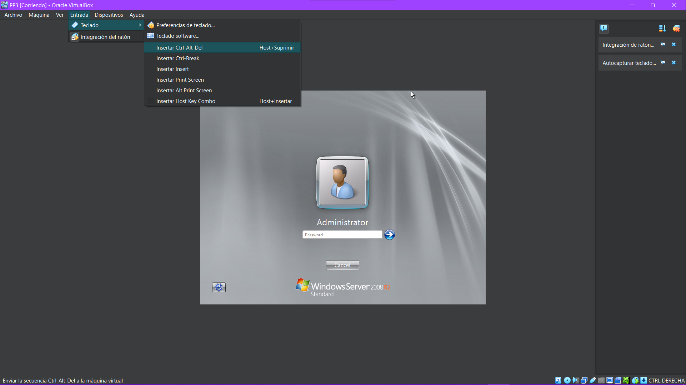
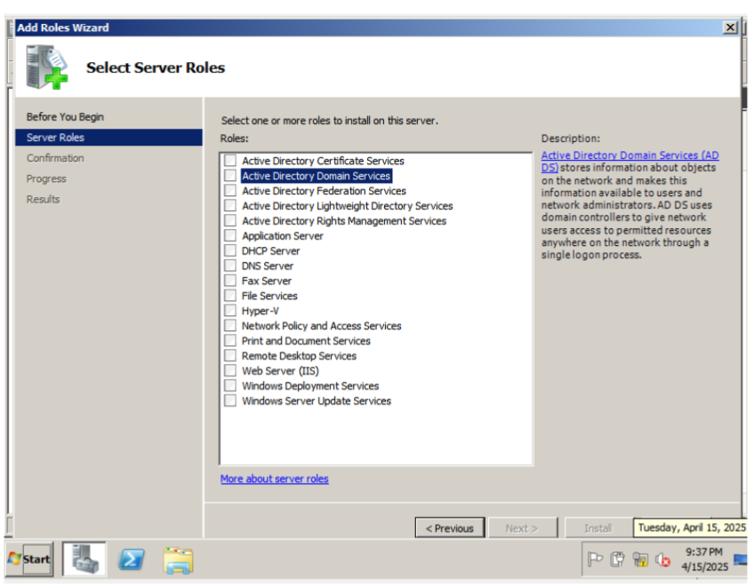
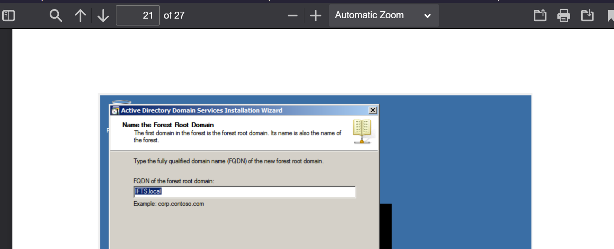
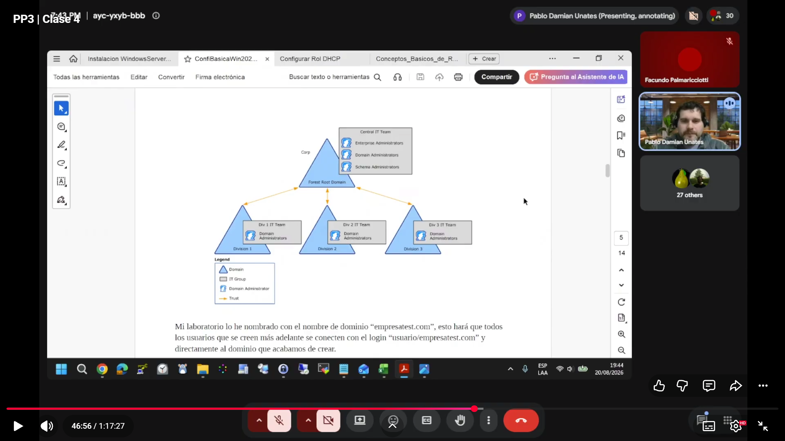

# Clase 03
# Poniendo en marcha máquina virtual

Al reiniciar

> [!NOTE]
> Sacar pantalla completa
> `ctrl DERECHO + F`

El rol Active Directory Domain Service` es para
sirve para, vieron cuando hay páginas que son `http` y `https`, indica que  tiene una securizacion. se da atraves de certificados, para una red interna y para que esa página sea segura va a tener que tener una serie de certificados, si lo uso a nivel local, esos certificados van a tener que estar emitidos por una entidad del dominio, la idea es que habilitemos este rol  y emitamos un certificado para que podamos usar el httpS dentro de la empresa. aveces pueden o no darlo. 

se usa tmb para securizar las conexiones que vamos a tener a ciertos servidores o a ciertos recursos, que todos tengamos ese certificado para poder acceder a la web de manera segura,

hasta acá sólo se creó el rol, pero no se configuró.
"este servidor que ya tiene habilitado el rol de Active directory, lo vamos a promover a AD, para que lo pueda usar"

en estos parametros se carga el dominio que yo compré

El triangulo hace referencia a un dominio
Acá el triangulo indica un forest, que contiene varios dominios

