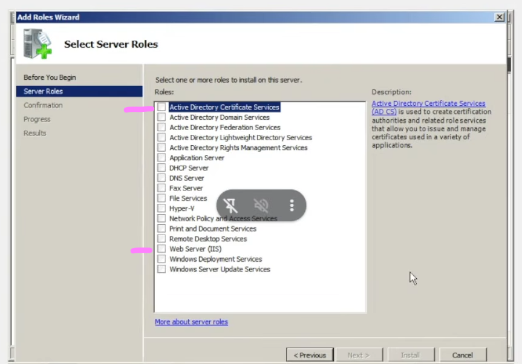

# Clase 5 DNS - AD
_clase 6_

IP estática vs IP dinámica

Por defecto viene la configuracion de ip dinámica

IP Fija/estática:
Que cuando referenciamos esa IP nos vamos a poder conectar sin problema, no se tiene que buscar por otra caracteristica del equipo para saber qué IP tomó para poder conectarnos. 


La IP de DNS no va a ser la del provedor de internet, sino la local de mi máquina, el localhost `127.0.0.1`

El equipo toma esta IP de manera local 

El tracer  marca los saltos que hace la red

Active Directory Certificate Services -  para que pueda tener una página web con securizado, con https esta página va a tener que tener un https, un certificado para que peda ser válida y no sea descartada cómo peligrosa

Le puedo dar el rol a este servidor de emitir este certificado y que a traves de eso, sea segura esa página web, sea https y se pueda consumir

si es http:
Web Server IIS - HTTp, alcanza para configurar la página http dentro de este servidor y poder consumirla hacia este servidor con la ip que le asignemos


42.00
> [!NOTE] Note | Active Directory Domain Services
> AD - Administrar y gestionar usuarios y dispositivos que van a estar conectados dentro de la red

- Application server - para configurar cómo un servidor de aplicacion
- DHCP Server - Planilla donde se configuran las IP. Rangos de IP. Y se aclara si estas IP son estáticas dinámicas qué tipo de uso se les va a dar. Cada cuanto queremos que se rnueven. 
- DNS Server - Va a generar la tabladonde vamos a configurar el nombre de la página web dentro de este dominio y le vamos a decir hacia qué IP la va a tener qué direccionar. `Cualquier conexion WEB hace referencia a una ip y un puerto`
- File service - es para recursos compartidos, para compartir una carpeta cómo se hace normalmente con windows de escritorio. lo que va a tener asociado es que va a permitir trabajar con grupos y atraves de eso va a permitir gestionar cúal es la ubicacion física, la ubicacion que le vamos a decir que va a consumir el usuario. que por lo general no coincide con la ubicacion física y administrar los grupos de lectura, escritur.
- Hyper-V - virtualizacion 
- Remote Desktop Service - granja de equipos virtuales. asi como se configura una virtualizacino, puedo tener dentro del windows server una granja con determinada cantidad de equipos para consumir estos servicios.
  - en gral no te van a dar un equipo, te van a dar una conexion por RDS a un equipo de esta granja virtual para que puedas hacer testing dentor de la red empresarial

> [!TIP] TIP | Un servidor no tenga más de 4/5 roles para no sobrecargarlo
> y porque si se pierde o pasa algo, no se pierde todo.

> [!IMPORTANT] Important | dcpromo - AD
> busco `dcpromo`, para promover el Windows server a Directorio Activo 
> Vamos a tener un dominio, que va a estar dentro de un bosque. Creamos de cero el dominio, que va a estar asociado a ese bosque (acá va el nombre de dominio que comprarias y el DNS son los DNS del dominio que compré)
>
> Nivel funcional qué va a tener el bosque, si quiero hermanar el dominio con otro o consumir recursos de otro dominio van a tener que pertenecer al mismo forest. `Windows Server 2008 R2`, de este nivel funcional para abajo va a ser compatible 

> [!IMPORTANT] Important | Activar DHCP para promover a AD
> Hay que configurar el DNS Server para poder promover el servidor a Active Directory
>
> Es una tabla donde va a estar referenciado el host, con la ip a la que hace referencia. Se configura, donde se va a crear esta tabla. Es un MySQL chiquito

> [!IMPORTANT] Important | Usuario de dominio y de equipo
> Son distintos, para configurar determinadas cosas, te pide distintos entre estos 2. Nosotros le pusimos la misma clave para no volvernos locos

> [!IMPORTANT] Important | Unidad Organizativa OU

Punto de restauracion, backups, ambientes es la mejor opción, pero en gral no coincide dev con prd


```cmd

```
> [!NOTE] Note |
> [!IMPORTANT] Important |
> [!WARNING] Warning |
> [!TIP] TIP |
