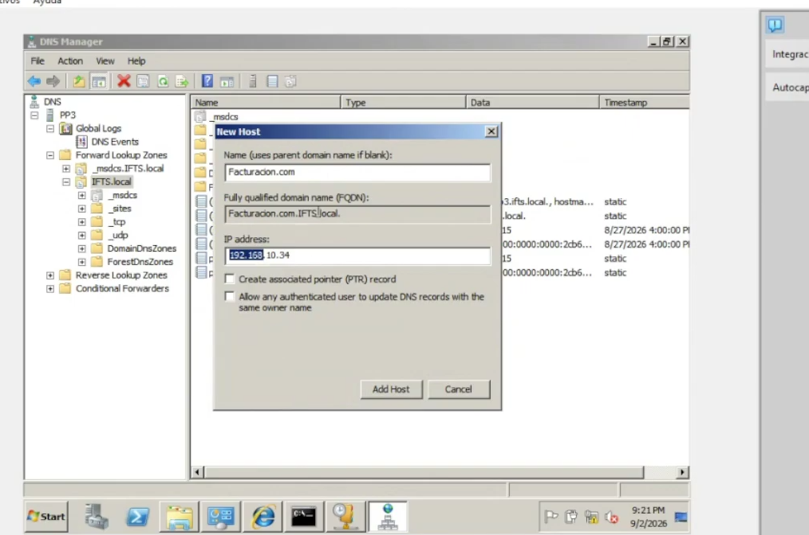
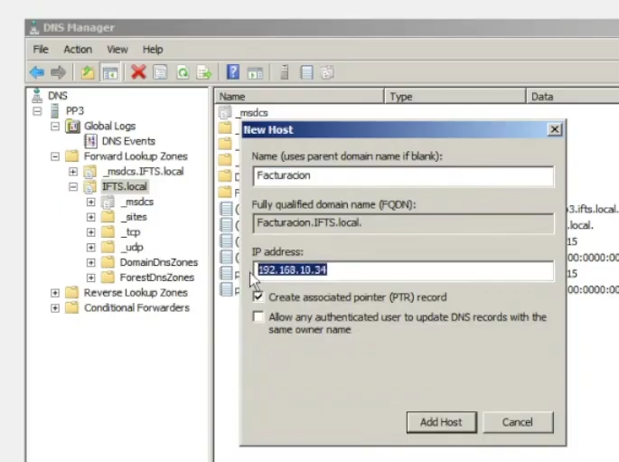
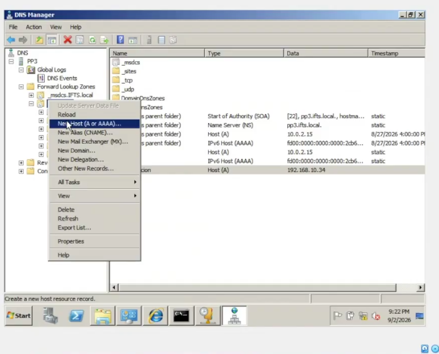

# Clase 6 - DHCP y Network (seguridad)
_clase 5_

`Server Manager`, que es el que va a organizar esto, donde vamos a disponer de los roles que vamos a administrar en windows server


Tiene salida a red, por internet explorer 

1° se habilita
2° se configura 

## 2do instructivo, activar DHCP y Network Policy

`VPN`: Virtual Private Network: Mediante una app se genera un túnel desde una red hacia una red privada. Se instala un cliente de vpn para trabajar con la red de una empresa. 

`DHCP Server > IPv4 DNS Settings > Preferred DNS server IPv4`: la ip qué tomó el servidor

el valor sale de 
```cmd
ipconfig # 10.0.2.15
```

Es el valor que tomó esta máquina al inicio para esta virtualizacion, le dijimos que sea fija, no dinámica. Para poder configurar el rol de DNS y el rol de AD. Todo eso requiere una ip FIJA no dinamica. 

16.00
`DHCP Server > DHCP Scopes (zonas rangos)`

DHCP SON DINÁMICOS

Se lepuede poner nombres a las zonas.'Redguest'
Empieza en `192.168.10.1` y termina en `192.168.10.30` son 29 IPS disponibles. 
Duran 8 horas u 8 dias, se vencen. 

Hay que borrar las ips a medida que se desconectan. El router nos da una ip dinamica que se renueva cada 2/3 horas,  la ventaja es que no se sature con las direcciones ip que va a tener para esa sub red.

Por 2 razones: por hardware, porque no va a tolerar muchas conexiones simultaneas y tmb para no sobrecargar la red, porque aprte de tener una ip reservada para un det disp va a hacer que no se pueda asignar otra y que tnga recursos asignados sobre esa ip. porque genera carga. 

en una red hogareña no se nota como en una empresarial. 

a nivel empresa la configuracion no se hace dsede aca sino que se hace desde el router, tenes un router en formato  como repdoructor de dvd una bahia. para hacer las conexiones, eso va a ir a algo similar a una zapatilla un rack, donde va a las bocas de redes donde lo instalé.

en algo más macro, la configuracion se hce desde acá, en windows server. 
le digo, para todo lo que es rango dinamico, vas a poder asignar rangos dinamicos en este rango y eso va a ser lo visible dentro del dominio, pero para segmentarlo mas y tener mas control esto se hace puntualmente en cada equipo. 

estoy asignando ips, pero podria asignar trafico. estas 30 ips solo pueden consumir cómo mucho 1mg de lo que tengo de red. 


> [!NOTE] Esto es a nivel dominio, dominio IFTS

se configura una zona un scope con un nombre de referencia y dependiendo del router voy a poder hilar más fino . voy a poder hacer que estas ips se liberen cada 2hs, asignarle, un ancho de banda especifico, que la conexion ip fija sea por el nro MAC de la placa de red del dispositivo

26.00 fallas
subimos una app, en un servidor donde ese desarrollo va a estar asociado a una ip. si no cargo el DNS, no setee bien el desarrollo  donde va a estar alojado. 
puede que se le esté asignando una ip dinamica. entonces te conectas al.3, en unas horas al .5
eso no deberia pasar, no deberias estar dentro de un rango 

28.00
me conecté a tal ip, tiene nombre reservado? hay q preguntarle a tal area

30.00
Se habilitó el rol, se configuraron los parametros. Ahora, cómo lo administramos?
DCHP > pp3.ifts.local >
                        IPV4
                            scope (alcance que va a tener) redguest
                        IPV6

DHCP es para administrar IPS, cómo las administra? por rangos.
se arman bloques, que son rangos de ip para lo que vaya a usar, se segmenta.
pueden ser dinamicos como estaticos, es ente caso DHCP

> [!IMPORTANT] Important | DHCP y dns
> 
> DHCP = Dyanmic Host,IPS DINAMICAS
> DNS = Domain Name Server, IPS 
> diferencias? 
> DNS se encarga de resolver el nombre que cargo, el nombre del dominio

> [!TIP] TIP | Pág web que solo puedo acceder por ip
> Si me pasa que tengo una pág web y solo puedo acceder por ip, no está resolviendo la ip. no está traduciendo a dominio. puede ser porque no tiene un nombre
>
> escribo google, instagram, diario y me lleva a la página. google lo que hace es que es un gran serviidor donde tiene almacenadas todas estas páginas web y tiene la referencia de que ese nombre responde a tal ip, y con eso hace la conexión 
> 
> si google no tuviera registrado ese nombre, no se podria acceder porque no se sabe a que ip tiene que direccionar
> 
> es una tabla, donde está referenciado el nombre con la ip
> google hace un escaneo de las páginas que hay disponibles en la red para poder tener estas ips disponibles 

si tengo reservado el nombre, responde al nombre pero no hay nada del otro lado porque no pusimos el desarrollo todavia 

39.00 - 43.00 



Un punto asociado de retorno PTR, para que  por nombre o ip vaya al mismo lugar 

(New host) Registro A que va a tener una IP asociada 

(New alias) CNAME
en este sistema, esta ip no queda accesible para una parte de la empresa, entonces se le puede asignar un alias para que puedan acceder o resolver hacia este nombre y redireccione hacia esta ip

o cuando se tienen varios nombres asociados a la misma ip, va a ser un nombre solo acá

pero se puede dar el caso de que esta app este desarollo lo tengamos en varios sites, porqué? por un tema de consumo.

si acceden miles de usuarios, si solo tenemos centralizado en un servidor con una sola ip va a colapsar
entonces generamos otro registro con otro nombre donde va a ir asociado a otra ip 

hago lo mismo en otro servidor, con estos mismos roles activos que va a tener otra ip. le ponemos el mismo nombre y lo asociamos a una nueva ip

si uno está colapsado, lo va a redireccionar al otro.
va a funcionar como un balanceador, va a repartir la carga 

```cmd
ping facturacion
```
devuelve time out pq no hay nada del otro lado, ningun desarrollo. pero está reservada la ip

osk teclado en pantalla 

57.00
DHCP - seteo RANGO dinamico de ips 
solo asocia el nombre con una ip

para accedera un recurso, lo recomendable es que ese recurso tenga una ip fija.
pq si cambia cada 8hs no vamos a saber donde acceder y tapoco va a saber el DNS

ips dinamicas osn en gral apra poder conectarte a la red. son de segmento. ahi van los rangos y limitaciones


hicimos una red de guest, de invitados. va a tener slaida a la red acotado, limitado.
en una red corporativa, no va a ser libre todo. te restringen lo que ellos quieran.

DENTRO DEL DOMINIO

DNS - RESuelve nombres de dominio. le pregunto por un nombre y me va a decir que ip tiene asociada 

si quiero consumir algo dentro del dominio, voy a necesitar apuntar a ese algo, apunto atraves de una ip fija. 
el recurso tiene que tener una ip fija. para poder asociar un nombre de dominio a esa ip 


```cmd

```
> [!NOTE] Note |
> [!IMPORTANT] Important |
> [!WARNING] Warning |
> [!TIP] TIP |


