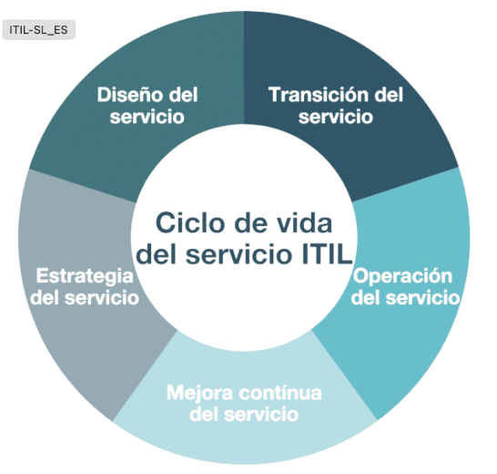

# Clase 08


# Modelo ITIL - Ciclo de vida del servicio

## ¿Qué es ITIL?  Information Technology Infraestructure Library

es un marco de buenas prácticas para la Gestión de Servicios de IT, centrado en entregar valor al negocio

permite gestionar servicios it de forma estructurada, alineada al negocio y orientada a la mejora continua

## Ciclo de vida del servicio ITIL - 5 etapas:

El que dirige y se revincula con las areas es el PM
Son 5 etapas y hasta que no se finalizan, hasta que no se cumple el ciclo de vida completo no se puede volver a redimensionar, corregir 

1) Estrategia del servicio
2) Diseño/desarrollo del servicio
3) Transición/implementacion del servicio
4) Operación del servicio
5) Mejora continua del servicio


## 1. Estrategia del servicio
Define qué servicios se ofrecerán y a quién

Objetivo: Alinear IT con el negocio

Procesos:
- Gestión del portafolio de servicios
- Gestión financiera
- Gestión de la demanda

> [!NOTE] Portafolio = catalogo de servicios que se ofrecen
> Roles que se necesitan cubrir 

## Ejemplo: Estrategia del servicio

Una empresa define ofrecer un servicio de Mesa de ayuda 24/7 para áreas críticas del negocio

## 2. Diseño/desarrollo del servicio
Diseña cómo será entregado el servicio.
Parte del relevamiento de la necesidad del cliente

Procesos clave: 
- Gestión del nivel de servicio SLA
  - SLA = El período el tiempo que nosotros tenemos para cubrir determinada solicitud. No es lo mismo que una tecla no funcione a que; alguien esta dando de alta cliente o nopuede facturar algo, situaciones donde no pueden trabajar.
- Gestión de capacidad.
  - Qué tan disponible va a estar ese servicio, en qué tiempo se va a cumplir ese servicio en caso de tener algun incidente onconveniente. 
- Gestión de disponibilidad
- Gestión de seguridad de la información 
  - Cómo securizamos lo que se entrega

### Ejemplo - Diseño/desarrollo del servicio
Se definen SLAs (el tiempo para la resolucion), herramientas ITSM, horarios de atención y roles de soporte.
Definir quien va a hacer qué tarea. 

## 3. Transición/implementacion del servicio
Construye y despliega el servicio en producción. requiere documentacion
Cómo se hace la entrega del servicio?  

Sugiere que las implementaciones sean a traves de cambios, donde se involucren todas las áreas que puedan estar afectadas, esos cambios van a contener:
- horarios donde se va a implementar
- aprobacion de la gente que va a etar involucrada
- permitir rollback para que no afecte el servicio

Procesos clave: 
- Gestión de cambios
- Gestión de versiones y despliegues
- Gestión de activos y configuraciones CMDB

### Ejemplo - Transición/implementacion del servicio
Se implementa la herramienta de Tickets, se capacita la personal y se hace el go-live
Separa los pedidos de servicio de lo que son incidentes

Un pedido de servicio, es: quiero cambiar la silla

En ITIL un teclado no se considera un incidente.

> [!IMPORTANT] Important | Usos de la ticketera

La ticketera sirve para sacar métricas. Acerca de los pedidos, cosas que se requieren. Trazabilidad acerca de qué es lo que se tocó.

Si se rompe X cantidad de dispositivos, cuantos voy a tener que tener disponible en el año/mes, y eso llevarlo a costos. 

13.00
Hay documentacion que tenes que completar para poder entregar el desarrollo que se hizo. No solo implementarlo sino tambien desplegarlo en los equipos, asegurarse que todos tengan acceso. 

Documentacion técnica, cómo se implementa, requisitos, qué precisa. Guía de troubleshoot.
Hay que hacer y exigir la documentacion.

## 4. Operación del servicio
Entrega y soporte diario del servicio. Ya implementado

Procesos clave: 
- Gestión de incidentes
  - Falta de acceso, que no pueda trabajar por alguna razon. Se cayó el servidor, la app, la pc no anda.
- Gestión de problemas
  - INCIDENTES RECURRENTES. PROBLEMA CONOCIDO.
  - definir un responsable, aceptar el problema si no se puede solucioanr por alguna imposibilidad. decir que puede funcionar hasta acá, bajo estas medidas. 
- Gestión de solicitudes
  - pedidos de servicio, cambiar el teclado, silla. se quemó tal lampara. luego se deriva.
- Gestión de accesos
  - relacionado con AD

### Ejemplo - Operación del servicio
Los usuarios reportan incidentes, el equipo los resuelve y se restaura el servicio.


## 5. Mejora continua del servicio
Busca mejorar continuamente los servicios.
Mantenimiento/nueva necesidad

ciclo PDCA:
- PLAN
- Do
- Check
- Act

### Ejemplo - Mejora continua del servicio
Se analizan métricas, se reducen tiempos de atención y se  optimizan procesos.


# Modelo SCRUM - Ciclo de vida del producto
Scrum - Marco de trabajo ágil para desarrollar y gestionar productos complejos mediante iteraciones cortas llamadas sprints. 

ACá en cada etapa, se involucra a todos en todas las etapas 

El scrum master es el que tiene las reuniones con el cliente y el equipo
Pero el que gestiona el proyecto va a ser el que gestiona el area. 

Scrum busca acortar los tiempos de error. Busca entregar pequeñas cosas e interactuar con el cliente

## Ciclo de vida en scrum
No tiene fases rígidas cómo en los modelos tradicionale, pero sigue un ciclo iterativo e incremental, 5 etapas: 

1) Inicio del producto 
2) Planificación
3) Desarrollo (sprint)
4) Revisión e inspección
5) Mejora continua


27.00
## 1. Inicio del producto
- Se define la visión del producto

Actividades:
- Identificación de stakeholders (promotores, interesados)
- Definición de objetivos
- Cración inicial del product backlog

### Ejemplo - Inicio del producto
Una empresa decide crear un portal web para atención a clientes y define sus objetivos principales.


## 2. Planificación del sprint
Se decide qué se construye en el sprint

Actividades:
- Sprint planning
- Selección de historias
- Definicion del sprint global. El rtado final 

### Ejemplo - Planificación del sprint
El equipo selecciona historias para el sprint de 2 semanas y define el objetivo del sprint

## 3. Desarrollo del sprint
El equipo trabaja en los incrementos del producto

Eventos clave:
- Desarrollo
- Daily scrum (reunión diaria)

### Ejemplo - Desarrollo del sprint
Los desarrolladores construyen funcionalidades y reportan avances diarios.


## 4. Revisión del sprint
Se inspecciona el incremento entregado.

Evento:
- Sprint review

Objetivo: 
- Obtener feedback del cliente

### Ejemplo - Revisión del sprint
Se muestra el funcionamiento del sistema al cliente y se recibe una retroalimentacion 

## 5. Retrospectiva y mejora continua
Se mejora la forma de trabajo del equipo

Evento:
- Sprint review

### Ejemplo - Retrospectiva y mejora continua
El equipo ajusta procesos para mejorar la comunicacion y productividad


## Roles en scrum
- PO
- scrum master
- equipo de desarrollo 

# Modelo híbrido. SCRUM + ITIL 33.0

Diferencias

En ITIL hasta que no llegas a mantenimiento no vas a tener un feedback del cliente acerca de si era eso o no lo que queria. 

En scrum al ser ciclos cortos vamos a estar mostrando cada x semanas un avance para saber si está conforme

el modelo hibrido combina procesos estables para la operacion con flexibilidad para el desarrollo rápido de productos

ITIL se enfoca en la gestión y operación de servicios, mientras que Scrum impulsa la mejora continua y adaptabilidad

la idea es usar la estructura/proceso escalonado de ITIL y meter scrum para tener el mejor rendimiento

Los que desarrollan usan scrum y gestion y soporte usa ITIL


```cmd

```
> [!NOTE] Note |
> [!IMPORTANT] Important |
> [!WARNING] Warning |
> [!TIP] TIP |
